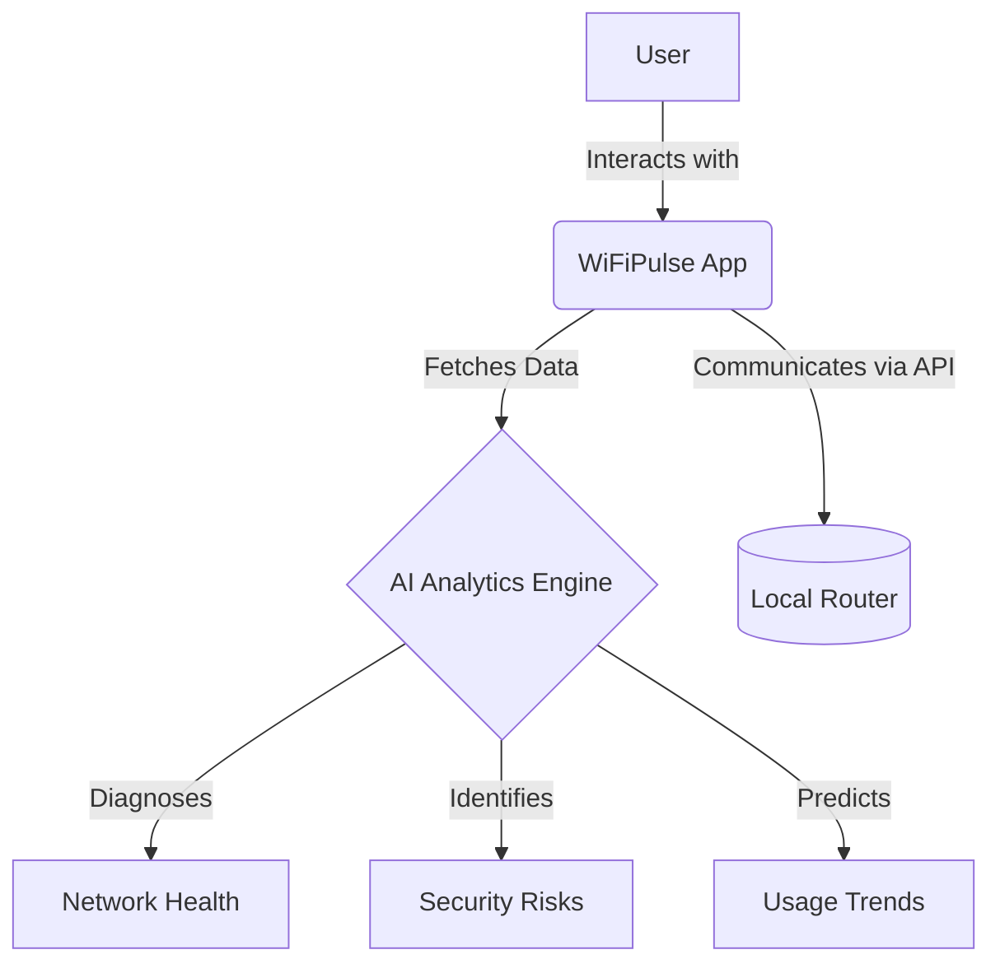

# WiFiPulse
## Master Product Requirements Document
### Version 1.0

 
 

**Prepared By:** `[Placeholder: Author Name/Team]` 
**Date:** `[Placeholder: YYYY-MM-DD]` 
**Status:** `[Placeholder: Draft / Under Review / Approved]` 

---

## Document Metadata

| Property | Details |
|----------|---------|
| **Document Owner** | `[Placeholder: Name/Role]` |
| **Product Manager** | `[Placeholder: Name]` |
| **Technical Lead** | `[Placeholder: Name]` |
| **Target Release** | `[Placeholder: Target Release Version]` |

## Revision History

| Version | Date | Author | Description of Changes |
|---------|------|--------|------------------------|
| 1.0 | 2026-06-30 | AI Assistant | Initial PRD Template Creation |
| 1.1 | 2026-06-30 | AI Assistant | Wrote PRD Chapter 1 (Sections 1-7) |

## Approvals

| Name | Role | Date | Signature |
|------|------|------|-----------|
| `[Name]` | Product Manager | `[YYYY-MM-DD]` | `[Signature/Approved]` |
| `[Name]` | Engineering Lead | `[YYYY-MM-DD]` | `[Signature/Approved]` |

---

## Conventions & Guidelines

### Requirement ID Conventions
All requirements must be tracked using a unique identifier following this format: `[CATEGORY]-[NUMBER]`.
- **REQ-F-###**: Functional Requirements
- **REQ-NF-###**: Non-Functional Requirements
- **REQ-S-###**: Security Requirements
- **REQ-UI-###**: UI/UX Requirements

### Feature Numbering
Features are numbered hierarchically corresponding to their module (e.g., `Module 1.0`, `Feature 1.1`, `Sub-feature 1.1.1`).

### Priority Definitions
| Priority | Definition |
|----------|------------|
| **Critical** | Essential for product launch (P0). Product cannot ship without it. |
| **High** | Important feature (P1). Adds significant value but has workarounds. |
| **Medium** | Nice to have (P2). Improves UX but not strictly necessary for core function. |
| **Low** | Minimal impact (P3). Candidate for future releases. |

### Requirement Status Definitions
- **Proposed:** Initially drafted, pending review.
- **Approved:** Approved by stakeholders for implementation.
- **In Progress:** Currently under development.
- **Completed:** Developed, tested, and integrated.
- **Deferred:** Pushed to a future release phase.

---

## Table of Contents
1. [Executive Summary](#1-executive-summary)
2. [Product Vision](#2-product-vision)
3. [Mission Statement](#3-mission-statement)
4. [Problem Statement](#4-problem-statement)
5. [Solution Overview](#5-solution-overview)
6. [Product Goals](#6-product-goals)
7. [Non Goals](#7-non-goals)
8. [Target Audience](#8-target-audience)
9. [User Personas](#9-user-personas)
10. [Market Research](#10-market-research)
11. [Competitive Analysis](#11-competitive-analysis)
12. [Feature Roadmap](#12-feature-roadmap)
13. [Functional Requirements](#13-functional-requirements)
14. [Non Functional Requirements](#14-non-functional-requirements)
15. [Information Architecture](#15-information-architecture)
16. [Feature Modules](#16-feature-modules)
17. [Technical Architecture](#17-technical-architecture)
18. [UI Design Principles](#18-ui-design-principles)
19. [Security Requirements](#19-security-requirements)
20. [AI Features](#20-ai-features)
21. [Router Integration Strategy](#21-router-integration-strategy)
22. [Database Design](#22-database-design)
23. [API Design](#23-api-design)
24. [Performance Requirements](#24-performance-requirements)
25. [Testing Strategy](#25-testing-strategy)
26. [Analytics](#26-analytics)
27. [Accessibility](#27-accessibility)
28. [Monetization Strategy](#28-monetization-strategy)
29. [Release Plan](#29-release-plan)
30. [Future Roadmap](#30-future-roadmap)
31. [Risks](#31-risks)
32. [Assumptions](#32-assumptions)
33. [Open Questions](#33-open-questions)
34. [Glossary](#34-glossary)

---

## 1. Executive Summary
WiFiPulse is a premium, AI-powered Wi-Fi intelligence platform designed exclusively for Android. It bridges the gap between complex network administration and everyday user experience by offering an intuitive, aesthetically stunning application for managing, analyzing, and securing home networks. By leveraging on-device analytics and AI-driven insights, WiFiPulse empowers users to optimize their connectivity, detect security vulnerabilities, and control connected devices without requiring advanced technical knowledge.

## 2. Product Vision
To be the definitive command center for the modern connected home, transforming invisible network data into actionable, easy-to-understand intelligence that guarantees secure and seamless digital experiences for every user.

## 3. Mission Statement
To deliver a flawless, high-performance Android application that abstracts the complexity of router management and network diagnostics into a beautiful, Material 3 interface, providing users with unprecedented visibility and control over their Wi-Fi environments.

## 4. Problem Statement
Home networks are becoming increasingly congested and vulnerable due to the proliferation of IoT devices. However, traditional network management tools and ISP-provided router applications are often fragmented, visually outdated, and overwhelmingly technical. Users struggle to identify why their internet is slow, who is connected to their network, or whether their network is secure, leading to frustration and unresolved connectivity issues.

## 5. Solution Overview
WiFiPulse provides a unified, mobile-first solution that automatically discovers and connects to the user's local router. 

The platform offers real-time dashboards for speed, usage, and device tracking, coupled with an AI analytics engine that proactively diagnoses network bottlenecks and security risks, presenting solutions in plain language.

## 6. Product Goals
- **G-1:** Achieve a cold startup time of under 2 seconds to ensure immediate access to network controls.
- **G-2:** Deliver a frictionless onboarding experience that successfully detects and connects to standard home routers with zero manual configuration.
- **G-3:** Provide proactive AI-driven alerts for unusual network activity or unauthorized device connections.
- **G-4:** Establish a premium visual identity that rivals top-tier consumer applications, measured by high user retention and aesthetic satisfaction scores.

## 7. Non Goals
- **NG-1:** We will not build custom router hardware; WiFiPulse is strictly a software platform interfacing with existing consumer routers.
- **NG-2:** We will not support iOS or Web platforms in the initial V1 release to maintain a laser focus on Android excellence.
- **NG-3:** We will not provide enterprise-grade B2B network management features (e.g., multi-site SDN management).

## 8. Target Audience
> `[Placeholder: Define the primary and secondary demographic targets.]`

## 9. User Personas
> `[Placeholder: Describe 2-3 key user personas with their behaviors, needs, and pain points.]`

## 10. Market Research
> `[Placeholder: Summarize key market trends supporting the product.]`

## 11. Competitive Analysis
> `[Placeholder: List key competitors, their strengths, weaknesses, and WiFiPulse's competitive advantage.]`

## 12. Feature Roadmap
> `[Placeholder: Provide a high-level timeline or phased release schedule of major features.]`

## 13. Functional Requirements
> `[Placeholder: Detailed list of functional requirements using the defined REQ-F-### conventions.]`

## 14. Non Functional Requirements
> `[Placeholder: Detailed list of system performance, reliability, and usability requirements (REQ-NF-###).]`

## 15. Information Architecture
> `[Placeholder: Outline the application structure, navigation flow, and screen hierarchy.]`

## 16. Feature Modules
> `[Placeholder: Break down the application into discrete functional modules.]`

## 17. Technical Architecture
> `[Placeholder: Describe the system architecture, frameworks (Flutter, Riverpod), and infrastructure.]`

## 18. UI Design Principles
> `[Placeholder: Define the visual language, design system, and Material 3 adherence guidelines.]`

## 19. Security Requirements
> `[Placeholder: Detail encryption, authentication, authorization, and data protection rules (REQ-S-###).]`

## 20. AI Features
> `[Placeholder: Detail any AI/ML driven insights, automation, or analytics features.]`

## 21. Router Integration Strategy
> `[Placeholder: Explain how the application interfaces with and controls supported routers.]`

## 22. Database Design
> `[Placeholder: Outline the local (SQLite) and remote (Firebase) database schema structures.]`

## 23. API Design
> `[Placeholder: Describe external API endpoints, internal service contracts, and data structures.]`

## 24. Performance Requirements
> `[Placeholder: Define strict performance metrics, e.g., cold start < 2s, 60fps animations.]`

## 25. Testing Strategy
> `[Placeholder: Detail unit, integration, UI, and user acceptance testing methodologies.]`

## 26. Analytics
> `[Placeholder: Define what user behaviors, errors, and system metrics will be tracked.]`

## 27. Accessibility
> `[Placeholder: Outline ADA compliance goals, screen reader support, and contrast requirements.]`

## 28. Monetization Strategy
> `[Placeholder: Describe the revenue model, e.g., freemium, subscriptions, ads, or one-time purchase.]`

## 29. Release Plan
> `[Placeholder: Detail the alpha, beta, and public launch milestones.]`

## 30. Future Roadmap
> `[Placeholder: Outline visionary features and integrations planned beyond the initial release.]`

## 31. Risks
> `[Placeholder: Identify potential technical, market, or execution risks and mitigation strategies.]`

## 32. Assumptions
> `[Placeholder: List assumptions made during the PRD creation that require validation.]`

## 33. Open Questions
> `[Placeholder: List any unresolved product decisions that need stakeholder alignment.]`

## 34. Glossary
> `[Placeholder: Define project-specific terms, acronyms, and technical jargon.]`
