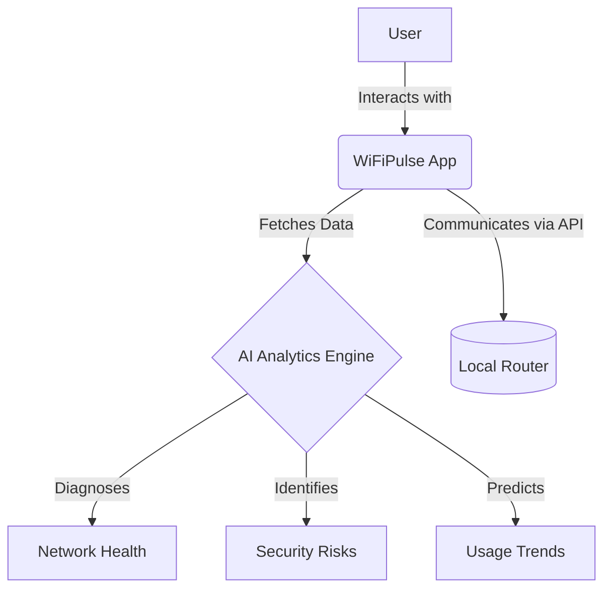

# WiFiPulse
## Master Product Requirements Document
### Version 1.0

 
 

**Prepared By:** `[Placeholder: Author Name/Team]` 
**Date:** `[Placeholder: YYYY-MM-DD]` 
**Status:** `[Placeholder: Draft / Under Review / Approved]` 

---

## Document Metadata

| Property | Details |
|----------|---------|
| **Document Owner** | `[Placeholder: Name/Role]` |
| **Product Manager** | `[Placeholder: Name]` |
| **Technical Lead** | `[Placeholder: Name]` |
| **Target Release** | `[Placeholder: Target Release Version]` |

## Revision History

| Version | Date | Author | Description of Changes |
|---------|------|--------|------------------------|
| 1.0 | 2026-06-30 | AI Assistant | Initial PRD Template Creation |
| 1.1 | 2026-06-30 | AI Assistant | Wrote PRD Chapter 1 (Sections 1-7) |
| 1.2 | 2026-06-30 | AI Assistant | Wrote PRD Chapter 2 (Product Strategy) |
| 1.3 | 2026-06-30 | AI Assistant | Wrote PRD Chapter 3 (Functional Requirements) |## Approvals

| Name | Role | Date | Signature |
|------|------|------|-----------|
| `[Name]` | Product Manager | `[YYYY-MM-DD]` | `[Signature/Approved]` |
| `[Name]` | Engineering Lead | `[YYYY-MM-DD]` | `[Signature/Approved]` |

---

## Conventions & Guidelines

### Requirement ID Conventions
All requirements must be tracked using a unique identifier following this format: `[CATEGORY]-[NUMBER]`.
- **REQ-F-###**: Functional Requirements
- **REQ-NF-###**: Non-Functional Requirements
- **REQ-S-###**: Security Requirements
- **REQ-UI-###**: UI/UX Requirements

### Feature Numbering
Features are numbered hierarchically corresponding to their module (e.g., `Module 1.0`, `Feature 1.1`, `Sub-feature 1.1.1`).

### Priority Definitions
| Priority | Definition |
|----------|------------|
| **Critical** | Essential for product launch (P0). Product cannot ship without it. |
| **High** | Important feature (P1). Adds significant value but has workarounds. |
| **Medium** | Nice to have (P2). Improves UX but not strictly necessary for core function. |
| **Low** | Minimal impact (P3). Candidate for future releases. |

### Requirement Status Definitions
- **Proposed:** Initially drafted, pending review.
- **Approved:** Approved by stakeholders for implementation.
- **In Progress:** Currently under development.
- **Completed:** Developed, tested, and integrated.
- **Deferred:** Pushed to a future release phase.

---

## Table of Contents
1. [Executive Summary](#1-executive-summary)
2. [Product Vision](#2-product-vision)
3. [Mission Statement](#3-mission-statement)
4. [Problem Statement](#4-problem-statement)
5. [Solution Overview](#5-solution-overview)
6. [Product Goals](#6-product-goals)
7. [Non Goals](#7-non-goals)
8. [Target Audience](#8-target-audience)
9. [User Personas](#9-user-personas)
10. [Market Research](#10-market-research)
11. [Competitive Analysis](#11-competitive-analysis)
12. [Product Positioning](#12-product-positioning)
13. [SWOT Analysis](#13-swot-analysis)
14. [Feature Roadmap](#14-feature-roadmap)
15. [Functional Requirements](#15-functional-requirements)
16. [Non Functional Requirements](#16-non-functional-requirements)
17. [Information Architecture](#17-information-architecture)
18. [Feature Modules](#18-feature-modules)
19. [Technical Architecture](#19-technical-architecture)
20. [UI Design Principles](#20-ui-design-principles)
21. [Security Requirements](#21-security-requirements)
22. [AI Features](#22-ai-features)
23. [Router Integration Strategy](#23-router-integration-strategy)
24. [Database Design](#24-database-design)
25. [API Design](#25-api-design)
26. [Performance Requirements](#26-performance-requirements)
27. [Testing Strategy](#27-testing-strategy)
28. [Analytics](#28-analytics)
29. [Accessibility](#29-accessibility)
30. [Monetization Strategy](#30-monetization-strategy)
31. [Release Plan](#31-release-plan)
32. [Future Roadmap](#32-future-roadmap)
33. [Risks](#33-risks)
34. [Assumptions](#34-assumptions)
35. [Open Questions](#35-open-questions)
36. [Glossary](#36-glossary)

---

## 1. Executive Summary
WiFiPulse is a premium, AI-powered Wi-Fi intelligence platform designed exclusively for Android. It bridges the gap between complex network administration and everyday user experience by offering an intuitive, aesthetically stunning application for managing, analyzing, and securing home networks. By leveraging on-device analytics and AI-driven insights, WiFiPulse empowers users to optimize their connectivity, detect security vulnerabilities, and control connected devices without requiring advanced technical knowledge.

## 2. Product Vision
To be the definitive command center for the modern connected home, transforming invisible network data into actionable, easy-to-understand intelligence that guarantees secure and seamless digital experiences for every user.

## 3. Mission Statement
To deliver a flawless, high-performance Android application that abstracts the complexity of router management and network diagnostics into a beautiful, Material 3 interface, providing users with unprecedented visibility and control over their Wi-Fi environments.

## 4. Problem Statement
Home networks are becoming increasingly congested and vulnerable due to the proliferation of IoT devices. However, traditional network management tools and ISP-provided router applications are often fragmented, visually outdated, and overwhelmingly technical. Users struggle to identify why their internet is slow, who is connected to their network, or whether their network is secure, leading to frustration and unresolved connectivity issues.

## 5. Solution Overview
WiFiPulse provides a unified, mobile-first solution that automatically discovers and connects to the user's local router. 

The platform offers real-time dashboards for speed, usage, and device tracking, coupled with an AI analytics engine that proactively diagnoses network bottlenecks and security risks, presenting solutions in plain language.

## 6. Product Goals
- **G-1:** Achieve a cold startup time of under 2 seconds to ensure immediate access to network controls.
- **G-2:** Deliver a frictionless onboarding experience that successfully detects and connects to standard home routers with zero manual configuration.
- **G-3:** Provide proactive AI-driven alerts for unusual network activity or unauthorized device connections.
- **G-4:** Establish a premium visual identity that rivals top-tier consumer applications, measured by high user retention and aesthetic satisfaction scores.

## 7. Non Goals
- **NG-1:** We will not build custom router hardware; WiFiPulse is strictly a software platform interfacing with existing consumer routers.
- **NG-2:** We will not support iOS or Web platforms in the initial V1 release to maintain a laser focus on Android excellence.
- **NG-3:** We will not provide enterprise-grade B2B network management features (e.g., multi-site SDN management).

## 8. Target Audience
### Primary Users
Everyday smartphone users who experience home network issues (buffering, dead zones) but lack the technical expertise to diagnose them using traditional router interfaces.

### Secondary Users
Parents and household managers needing visibility into network usage, connected devices, and basic parental controls to manage screen time and ensure digital safety.

### Enterprise Users
Remote workers and small office administrators who require enterprise-grade reliability, security monitoring, and uptime guarantees for critical professional communications.

### Geographic Scope
Global release, with initial localization in English. The application is designed to be hardware-agnostic, supporting standard ISP-provided routers globally.

## 9. User Personas

### 1. The Student
- **Background:** College student sharing an apartment with multiple roommates.
- **Goals:** Ensure stable connection for online classes and streaming.
- **Pain Points:** Frequent bandwidth throttling when roommates download large files; unable to access router admin panels.
- **Technical Skill:** Moderate to High.
- **WiFi Usage Pattern:** High streaming, gaming, and video conferencing.
- **Key Features Needed:** Device discovery, bandwidth hogs identification, speed test.

### 2. The Family/Home User
- **Background:** Parent managing a household with 10+ smart devices (phones, TVs, tablets).
- **Goals:** Keep the family safe online and manage screen time.
- **Pain Points:** Overwhelmed by technical jargon; worried about strangers accessing the network.
- **Technical Skill:** Low.
- **WiFi Usage Pattern:** General browsing, streaming, smart home automation.
- **Key Features Needed:** One-tap security audit, unknown device alerts, intuitive usage dashboards.

### 3. The Gamer
- **Background:** Competitive online gamer heavily reliant on low latency.
- **Goals:** Absolute minimum ping and zero packet loss.
- **Pain Points:** Intermittent lag spikes ruining competitive matches; lack of QoS (Quality of Service) controls.
- **Technical Skill:** High.
- **WiFi Usage Pattern:** Continuous low-latency data streams.
- **Key Features Needed:** Real-time latency tracking, AI-driven bottleneck diagnosis, offline support.

### 4. The Remote Worker
- **Background:** Professional working from home full-time, relying on VPNs and Zoom.
- **Goals:** 99.9% uptime during business hours; secure connection to corporate networks.
- **Pain Points:** Unpredictable dropouts during critical meetings; security compliance requirements.
- **Technical Skill:** Moderate.
- **WiFi Usage Pattern:** Heavy upload/download, constant video conferencing.
- **Key Features Needed:** Security monitoring, usage analytics, network stability scoring.

### 5. The Small Office
- **Background:** Manager of a small business or co-working space.
- **Goals:** Provide reliable guest Wi-Fi while keeping internal assets secure.
- **Pain Points:** Managing multiple access points; identifying rogue devices.
- **Technical Skill:** Moderate.
- **WiFi Usage Pattern:** High concurrent connections.
- **Key Features Needed:** Multi-router management, detailed usage analytics, AI insights.

### 6. The Network Enthusiast
- **Background:** Tech hobbyist running custom router firmware and smart home labs.
- **Goals:** Maximum visibility into packet routing, signal strength, and channel interference.
- **Pain Points:** Consumer apps abstract too much data, offering no real diagnostic value.
- **Technical Skill:** Expert.
- **WiFi Usage Pattern:** Extreme (IoT networks, NAS servers, homelabs).
- **Key Features Needed:** Advanced router management, deep AI insights, raw diagnostic data export.

## 10. Market Research
The home WiFi landscape is undergoing a massive transformation driven by the exponential growth of connected devices.
- **Growth of Home WiFi:** The transition to remote work and 4K/8K streaming has made robust home WiFi a utility as essential as electricity.
- **Connected Device Trends:** The average household now manages upwards of 15-20 connected devices, creating complex, multi-layered network environments that are highly susceptible to interference and bandwidth starvation.
- **Smart Home Adoption:** As IoT adoption accelerates, the attack surface for home networks expands. Users are increasingly aware of vulnerabilities but lack the tools to audit their smart home ecosystem.
- **Need for Network Visibility:** Traditional ISP routers provide "black box" experiences. When internet fails, users instinctively blame the ISP, unaware that the issue is often local channel interference or a specific bandwidth-hogging device.
- **AI-Assisted Networking:** The market is shifting from reactive diagnostics (user runs a speed test after lag occurs) to proactive AI-assisted networking (the system predicts lag based on historical usage and suggests channel switching).

## 11. Competitive Analysis

| Feature | WiFiPulse | Fing | WiFiman | Google Home | TP-Link Tether | Net Analyzer | Aruba Utilities |
|---------|-----------|------|---------|-------------|----------------|--------------|-----------------|
| **Device Discovery** | High | High | High | Low | Medium | High | High |
| **Usage Analytics** | High | Low | Low | Medium | Low | Low | Low |
| **AI Insights** | High | None | None | None | None | None | None |
| **Router Management**| High | None | None | High (Google Only) | High (TP-Link Only) | None | None |
| **Speed Test** | High | High | High | High | Low | None | Low |
| **Security Monitoring**| High | Medium| Low | Low | Low | Low | Low |
| **Offline Support** | High | Low | Medium| Low | Low | Low | Medium|

## 12. Product Positioning
WiFiPulse is fundamentally different from existing network tools. It is not just a passive WiFi scanner or a walled-garden router companion app. WiFiPulse is an **AI-powered WiFi Intelligence Platform**. 

While competitors like Fing offer raw network mapping and Net Analyzer offers technical diagnostics, they require the user to interpret the data. Conversely, apps like Google Home or TP-Link Tether offer great UX but are strictly locked to proprietary hardware. WiFiPulse bridges this gap by remaining hardware-agnostic, providing deep technical diagnostics, and crucially, utilizing AI to interpret that data into actionable, plain-English advice for the everyday user.

## 13. SWOT Analysis

### Strengths
- **AI-Driven Insights:** Differentiates the product from passive scanners by providing proactive solutions.
- **Hardware Agnostic:** Works across various router brands, avoiding vendor lock-in.
- **Premium UX:** Material 3 design provides a modern, trustworthy interface lacking in technical competitor apps.
- **Offline Support:** Core diagnostic features function even when the external internet is down.

### Weaknesses
- **API Limitations:** Deep router management depends on the availability and openness of specific router APIs.
- **Resource Intensive:** On-device AI analytics and continuous background monitoring may impact battery life.

### Opportunities
- **ISP Partnerships:** Potential to white-label the software for smaller ISPs lacking a premium mobile app.
- **Smart Home Integration:** Future integrations with Matter and Thread protocols to manage local IoT ecosystems directly.
- **Freemium Upsell:** Strong potential for monetizing advanced AI security audits or historical data retention.

### Threats
- **ISP Walled Gardens:** Major ISPs increasingly locking down local router access to force users into their proprietary apps.
- **OS Restrictions:** Android networking API restrictions (e.g., MAC address randomization, strict location permissions) complicating device discovery.
- **Incumbent Dominance:** Well-established apps like Fing possess massive existing install bases.

## 14. Feature Roadmap
> `[Placeholder: Provide a high-level timeline or phased release schedule of major features.]`

## 15. Functional Requirements (Chapter 3)

### Module 1: Authentication
- **Objective:** Securely authenticate users and manage their session state.
- **Description:** Provides the entry point into the application, supporting secure login, registration, password recovery, and guest access without forcing immediate account creation.
- **User Story:** As a new user, I want to create an account or continue as a guest so that I can securely manage my local network without unnecessary friction.
- **Functional Requirements:**
  - `REQ-F-010`: The app shall display a branded Splash screen for 2 seconds.
  - `REQ-F-011`: The app shall provide an Onboarding flow for first-time users.
  - `REQ-F-012`: The system shall allow Login via email/password and Google OAuth.
  - `REQ-F-013`: The system shall provide a Registration form with password strength validation.
  - `REQ-F-014`: The system shall support a Forgot Password flow via email reset.
  - `REQ-F-015`: The system shall allow a Guest Mode with limited cloud-sync features.
  - `REQ-F-016`: The system shall handle Session Management (token refresh, auto-logout on expiration).
  - `REQ-F-017`: The user shall be able to Logout from the settings menu.
- **Non-functional Requirements:** Authentication state must resolve in < 500ms from cache. Passwords must never be stored locally in plaintext.
- **User Flow:** Splash -> Onboarding -> Auth Gateway -> (Login / Register / Guest) -> Dashboard.
- **Edge Cases:** Network timeout during login; expired auth tokens requiring silent refresh; invalid credentials.
- **Permissions Required:** Internet access.
- **Dependencies:** Firebase Auth API, Secure Storage.
- **Future Enhancements:** Biometric login (Fingerprint/FaceID).
- **Acceptance Criteria:** User can successfully log in, remain authenticated across app restarts, and securely log out.

### Module 2: Dashboard
- **Objective:** Provide a centralized, real-time overview of the network's health.
- **Description:** The primary landing screen showing the current connected network, internet status, live traffic, and recent alerts.
- **User Story:** As a home user, I want to see a summary of my network's health as soon as I open the app so I know if everything is working correctly.
- **Functional Requirements:**
  - `REQ-F-020`: The dashboard shall display a Network Summary (SSID, BSSID).
  - `REQ-F-021`: The dashboard shall display Router Information (IP, Gateway).
  - `REQ-F-022`: The dashboard shall indicate live Internet Status (Online/Offline).
  - `REQ-F-023`: The dashboard shall show the Connected Device Count.
  - `REQ-F-024`: The dashboard shall display current Upload Speed and Download Speed.
  - `REQ-F-025`: The dashboard shall display current Ping/Latency.
  - `REQ-F-026`: The dashboard shall summarize Today's Usage in MB/GB.
  - `REQ-F-027`: The dashboard shall feature a Live Graph visualizing real-time bandwidth consumption.
  - `REQ-F-028`: The dashboard shall provide Quick Actions (e.g., Scan, Speed Test).
  - `REQ-F-029`: The dashboard shall display active Alerts and Recent Activity logs.
- **Non-functional Requirements:** Live graphs must render at 60fps and update every 1 second without draining the battery.
- **User Flow:** Successful Login -> Dashboard -> (Taps on metrics to navigate to detailed modules).
- **Edge Cases:** Phone connected to mobile data instead of WiFi; router reachable but internet down.
- **Permissions Required:** Location (required for Android to read SSID), Network State.
- **Dependencies:** Device Discovery Module, Usage Analytics Module.
- **Future Enhancements:** Customizable dashboard widgets.
- **Acceptance Criteria:** Dashboard accurately reflects the currently connected WiFi network and updates live metrics smoothly.

### Module 3: Device Discovery
- **Objective:** Identify and catalog every device connected to the local network.
- **Description:** Scans the local subnet to detect active devices, resolving MAC addresses, IP addresses, and identifying the vendor and device type.
- **User Story:** As an admin, I want to see a list of all devices on my network so I can identify unauthorized users.
- **Functional Requirements:**
  - `REQ-F-030`: The app shall Scan Network subnets (e.g., 192.168.1.x) for active hosts.
  - `REQ-F-031`: The system shall perform Device Detection via ARP/Ping sweeps.
  - `REQ-F-032`: The system shall attempt Device Type Identification (Phone, TV, PC).
  - `REQ-F-033`: The system shall perform Vendor Detection by resolving MAC Address OUI prefixes.
  - `REQ-F-034`: The system shall display the IPv4/IPv6 Address of each device.
  - `REQ-F-035`: The system shall resolve the local Hostname of devices.
  - `REQ-F-036`: The system shall flag Unknown Devices that do not match historical records.
  - `REQ-F-037`: The user shall be able to assign Device Nicknames.
  - `REQ-F-038`: The system shall automatically or manually assign Device Icons.
  - `REQ-F-039`: The system shall maintain a Device History of previously seen devices.
- **Non-functional Requirements:** Network scan must complete within 15 seconds for a standard /24 subnet.
- **User Flow:** Dashboard -> "Scan Network" -> Progress Indicator -> List of Devices -> Device Detail View.
- **Edge Cases:** Devices blocking ICMP ping; MAC address randomization on modern smartphones.
- **Permissions Required:** Local Network Access, WiFi State.
- **Dependencies:** OUI Database lookup service.
- **Future Enhancements:** Bonjour/mDNS scanning for deep device profiling.
- **Acceptance Criteria:** App correctly lists active devices with accurate IP and vendor information within 15 seconds.

### Module 4: Usage Analytics
- **Objective:** Track and visualize data consumption across the network.
- **Description:** Monitors bandwidth consumption, identifying trends, top consumers, and historical usage patterns.
- **User Story:** As a parent, I want to see which device is using the most data today so I can pause a heavy download during work hours.
- **Functional Requirements:**
  - `REQ-F-040`: The system shall track Per Device Usage (if supported by router API).
  - `REQ-F-041`: The system shall display Hourly Usage graphs.
  - `REQ-F-042`: The system shall display Daily Usage summaries.
  - `REQ-F-043`: The system shall display Weekly Usage trends.
  - `REQ-F-044`: The system shall display Monthly Usage totals.
  - `REQ-F-045`: The system shall provide Live Monitoring of current throughput.
  - `REQ-F-046`: The system shall display a Usage Timeline of significant data events.
  - `REQ-F-047`: The system shall identify Top Consumers (devices using the most data).
  - `REQ-F-048`: The system shall provide a Usage Forecast for the billing cycle.
  - `REQ-F-049`: The user shall be able to generate exportable Usage Reports.
- **Non-functional Requirements:** Analytics database must efficiently aggregate millions of data points without UI lag.
- **User Flow:** Dashboard -> Analytics Tab -> Select Timeframe -> View Top Consumers.
- **Edge Cases:** Router API does not expose per-device metrics; data counter resets on router reboot.
- **Permissions Required:** None directly (depends on router API access).
- **Dependencies:** Router Management Module.
- **Future Enhancements:** Deep packet inspection (DPI) category analysis (e.g., streaming vs. gaming).
- **Acceptance Criteria:** App accurately charts historical data usage and identifies high-bandwidth devices.

### Module 5: Speed Test
- **Objective:** Accurately measure the internet connection's raw throughput and latency.
- **Description:** A built-in testing suite to measure ping, jitter, download, and upload speeds against external servers.
- **User Story:** As a gamer, I want to test my ping and jitter to ensure my connection is stable before playing a competitive match.
- **Functional Requirements:**
  - `REQ-F-050`: The user shall be able to trigger a Manual Test.
  - `REQ-F-051`: The system shall support scheduled Automatic Tests in the background.
  - `REQ-F-052`: The test shall measure ICMP Ping latency to a nearest server.
  - `REQ-F-053`: The test shall calculate Jitter (variance in ping).
  - `REQ-F-054`: The test shall estimate Packet Loss percentage.
  - `REQ-F-055`: The test shall measure Download speed in Mbps.
  - `REQ-F-056`: The test shall measure Upload speed in Mbps.
  - `REQ-F-057`: The system shall maintain a Test History log for trend analysis.
- **Non-functional Requirements:** Speed test must accurately saturate the connection without crashing the app; minimal memory footprint.
- **User Flow:** Dashboard -> Speed Test -> "Go" -> Gauge Animation -> Results Summary -> Save to History.
- **Edge Cases:** Network disconnects mid-test; ISP throttles speed test servers.
- **Permissions Required:** Internet Access.
- **Dependencies:** External speed test API/infrastructure (e.g., M-Lab, Ookla).
- **Future Enhancements:** Local network speed test (device to router) vs. WAN speed test.
- **Acceptance Criteria:** Test accurately measures and records Ping, Download, and Upload speeds matching established benchmarks.

### Module 6: Security
- **Objective:** Identify and alert users to potential vulnerabilities on their local network.
- **Description:** Continuously monitors the network for unauthorized devices, weak encryption, and exposed ports.
- **User Story:** As a security-conscious user, I want to be alerted if my router has open ports or weak passwords so I can fix them.
- **Functional Requirements:**
  - `REQ-F-060`: The system shall issue an Unknown Device Alert when an unrecognized MAC address connects.
  - `REQ-F-061`: The system shall issue a New Login Alert when the router admin panel is accessed.
  - `REQ-F-062`: The system shall perform Weak Password Detection on the WiFi PSK (if known/provided).
  - `REQ-F-063`: The system shall perform Open Port Detection via UPnP or port scanning on the router IP.
  - `REQ-F-064`: The system shall calculate a Router Security Score (0-100).
  - `REQ-F-065`: The system shall detect the current WiFi Encryption standard (WEP/WPA2/WPA3).
  - `REQ-F-066`: The user shall be able to trigger a manual Security Audit.
  - `REQ-F-067`: The system shall maintain a Security Timeline of detected vulnerabilities and resolutions.
- **Non-functional Requirements:** Port scanning must be lightweight to avoid triggering ISP intrusion detection systems.
- **User Flow:** Dashboard -> Security Tab -> "Run Audit" -> View Score and Vulnerabilities -> Follow resolution steps.
- **Edge Cases:** Router blocks local port scanning; false positives on intentionally open ports (e.g., Plex).
- **Permissions Required:** Local Network Access.
- **Dependencies:** Device Discovery Module.
- **Future Enhancements:** Integration with known CVE databases for specific router firmware vulnerabilities.
- **Acceptance Criteria:** App successfully identifies WEP/WPA encryption and flags insecure configurations.

### Module 7: Router Management
- **Objective:** Provide direct control over router settings from within the app.
- **Description:** Interfaces with specific router APIs to allow users to change passwords, restart the router, and manage guest networks without using a web browser.
- **User Story:** As a home user, I want to restart my router from my phone when the internet is slow, without having to walk to the physical device.
- **Functional Requirements:**
  - `REQ-F-070`: The system shall maintain a directory of Supported Routers.
  - `REQ-F-071`: The system shall perform automatic Router Detection (Brand/Model).
  - `REQ-F-072`: The user shall be able to perform a Router Login via the app.
  - `REQ-F-073`: The user shall be able to issue a Restart Router command.
  - `REQ-F-074`: The system shall fetch a list of router-recognized Connected Clients.
  - `REQ-F-075`: The user shall be able to view and change the WiFi Name (SSID).
  - `REQ-F-076`: The user shall be able to perform a Password Update for the WiFi network.
  - `REQ-F-077`: The user shall be able to view and change the broadcasting Channel.
  - `REQ-F-078`: The user shall be able to configure custom DNS servers.
  - `REQ-F-079`: The user shall be able to toggle a Guest WiFi network on/off.
- **Non-functional Requirements:** Credentials must be stored securely using Keychain/Keystore. API calls must handle variable router response times.
- **User Flow:** Router Tab -> Enter Admin Credentials -> Authenticate -> Select "Restart" -> Confirm.
- **Edge Cases:** Router firmware updates changing the internal API; unsupported legacy routers.
- **Permissions Required:** Local Network Access.
- **Dependencies:** Reverse-engineered or official Router APIs (e.g., AsusWRT, TP-Link).
- **Future Enhancements:** Parental control scheduling (pausing internet for specific MAC addresses).
- **Acceptance Criteria:** User can successfully authenticate to a supported router and trigger a remote reboot.

### Module 8: AI Insights
- **Objective:** Translate raw network data into actionable, plain-English advice.
- **Description:** Analyzes network behavior to detect anomalies, suggest optimizations, and summarize complex data into digestible reports.
- **User Story:** As a non-technical user, I want the app to simply tell me *why* my Netflix is buffering and *how* to fix it.
- **Functional Requirements:**
  - `REQ-F-080`: The system shall generate a natural language AI Summary of network health.
  - `REQ-F-081`: The system shall generate a Daily Report of significant events.
  - `REQ-F-082`: The system shall generate a Weekly Report comparing week-over-week performance.
  - `REQ-F-083`: The system shall provide actionable Recommendations (e.g., "Change to Channel 6").
  - `REQ-F-084`: The system shall suggest Bandwidth Optimization strategies when usage peaks.
  - `REQ-F-085`: The system shall provide Device Suggestions (e.g., "Move your Smart TV to the 5GHz band").
  - `REQ-F-086`: The system shall trigger Smart Notifications for predictive failures.
  - `REQ-F-087`: The system shall use Predictive Analytics to forecast network congestion hours.
- **Non-functional Requirements:** AI generation must happen on-device where possible to preserve privacy, or via secure, anonymized API calls.
- **User Flow:** Dashboard -> "AI Insights" Card -> Read Summary -> Tap "Apply Fix" for automated resolution.
- **Edge Cases:** AI suggests a channel that is technically clear but suffers from non-WiFi interference (e.g., microwaves).
- **Permissions Required:** None directly.
- **Dependencies:** Backend LLM API or on-device ML models.
- **Future Enhancements:** Autonomous self-healing networks (app changes settings automatically).
- **Acceptance Criteria:** App successfully analyzes a simulated congested network and outputs a recommendation to change channels.

### Module 9: Notifications
- **Objective:** Alert users to critical network events in real-time.
- **Description:** A robust notification engine managing local, push, and email alerts based on user preferences.
- **User Story:** As a parent, I want a push notification immediately if a new device joins my network.
- **Functional Requirements:**
  - `REQ-F-090`: The system shall deliver OS-level Push Notifications.
  - `REQ-F-091`: The system shall display persistent In-app Alerts in a notification center.
  - `REQ-F-092`: The system shall be capable of sending Email Reports.
  - `REQ-F-093`: The system shall compile and send a Daily Summary notification.
  - `REQ-F-094`: The system shall compile and send a Weekly Summary notification.
  - `REQ-F-095`: The system shall bypass Do-Not-Disturb for specified Critical Alerts (e.g., network breach).
- **Non-functional Requirements:** Notifications must be delivered within 5 seconds of the triggering event.
- **User Flow:** Event occurs -> OS Push Notification -> User taps notification -> Opens specific app module.
- **Edge Cases:** User revokes notification permissions; background execution restricted by Android battery saver.
- **Permissions Required:** Post Notifications (Android 13+).
- **Dependencies:** Firebase Cloud Messaging (FCM).
- **Future Enhancements:** Webhook integrations (e.g., send alerts to Discord/Slack).
- **Acceptance Criteria:** App successfully requests notification permission and delivers a local alert when a new device is manually added to the database.

### Module 10: Settings
- **Objective:** Allow users to customize their application experience and manage their data.
- **Description:** Centralized configuration for UX, privacy, and data management.
- **User Story:** As a user, I want to switch the app to Dark Mode and export my data for my own records.
- **Functional Requirements:**
  - `REQ-F-100`: The user shall be able to toggle the app Theme (Light/Dark/System).
  - `REQ-F-101`: The user shall be able to select the application Language.
  - `REQ-F-102`: The user shall be able to toggle measurement Units (Mbps vs MB/s).
  - `REQ-F-103`: The user shall be able to configure granular Notification Settings.
  - `REQ-F-104`: The user shall be able to manage Privacy settings (opt out of analytics).
  - `REQ-F-105`: The user shall be able to Export Data (devices, history) to local storage.
  - `REQ-F-106`: The user shall be able to trigger a manual cloud Backup.
  - `REQ-F-107`: The user shall be able to Restore settings and history from a backup.
- **Non-functional Requirements:** Settings changes must apply instantaneously across the app without requiring a restart.
- **User Flow:** Profile Icon -> Settings -> Display -> Select "Dark Mode" -> UI updates immediately.
- **Edge Cases:** Storage full during export; network failure during backup.
- **Permissions Required:** Storage (if exporting directly to filesystem).
- **Dependencies:** Local Key-Value store (e.g., SharedPreferences).
- **Future Enhancements:** Cloud-synced settings across multiple devices.
- **Acceptance Criteria:** User can change the theme to Dark Mode and the selection persists upon app restart.

### Module 11: Reports
- **Objective:** Provide tangible, shareable records of network performance and security.
- **Description:** Generates formatted documents summarizing analytics, security, and AI insights.
- **User Story:** As a small office manager, I want to export a monthly PDF report of our network uptime to show to the business owner.
- **Functional Requirements:**
  - `REQ-F-110`: The system shall generate a formatted PDF Report.
  - `REQ-F-111`: The system shall generate a raw CSV Export for data analysts.
  - `REQ-F-112`: The system shall compile a comprehensive Monthly Report.
  - `REQ-F-113`: The system shall compile an AI Report detailing past recommendations and outcomes.
  - `REQ-F-114`: The system shall compile a Device Report listing all known MAC addresses.
  - `REQ-F-115`: The system shall compile a Security Report detailing audit scores over time.
- **Non-functional Requirements:** PDF generation must not block the main UI thread.
- **User Flow:** Analytics Tab -> "Generate Report" -> Select "PDF" -> Select "Last 30 Days" -> Share via OS Intent.
- **Edge Cases:** Attempting to generate a report with zero historical data.
- **Permissions Required:** Storage.
- **Dependencies:** PDF generation library.
- **Future Enhancements:** Scheduled automated emailing of reports.
- **Acceptance Criteria:** App successfully compiles a CSV of currently connected devices and opens the Android share sheet.

### Module 12: Offline Mode
- **Objective:** Ensure core functionality remains accessible even when WAN (Internet) access is down.
- **Description:** Graceful degradation of features when the local router cannot reach the internet, relying on local caching.
- **User Story:** As a user whose internet just dropped, I want to open the app and see my local network devices to figure out if my router is dead or just the ISP connection.
- **Functional Requirements:**
  - `REQ-F-120`: The system shall display Cached Devices from the local database when offline.
  - `REQ-F-121`: The system shall allow viewing of Cached Reports.
  - `REQ-F-122`: The system shall continue to collect Local Analytics (e.g., scanning the subnet) without internet.
  - `REQ-F-123`: The system shall display an Offline Dashboard clearly indicating WAN failure but LAN success.
- **Non-functional Requirements:** The app must not crash or show generic "Network Error" dialogs when attempting to load the dashboard without internet.
- **User Flow:** Internet drops -> User opens app -> Dashboard shows "No Internet" banner -> Local device scan still functions.
- **Edge Cases:** Cloud-only features (e.g., Speed Test, LLM AI Insights) gracefully disabled with clear messaging.
- **Permissions Required:** Network State.
- **Dependencies:** SQLite / Local Database.
- **Future Enhancements:** Peer-to-peer mesh syncing of device lists between instances of the app on the same LAN.
- **Acceptance Criteria:** App launches successfully in Airplane mode (with WiFi enabled) and displays the local device list from cache.

---

## Feature Priority Matrix

| Feature Module | Priority | Description |
|----------------|----------|-------------|
| **Dashboard** | Must Have | Essential landing page; core value proposition. |
| **Device Discovery** | Must Have | Core functionality; users must see what is on their network. |
| **Speed Test** | Must Have | Most common user action when diagnosing network issues. |
| **Authentication** | Must Have | Required for cloud sync and personalized settings. |
| **Settings** | Must Have | Required for basic app configuration (Theme, App preferences). |
| **Security** | Should Have | High value, but secondary to basic discovery and speed. |
| **Usage Analytics** | Should Have | Dependent on router API capabilities; high value if possible. |
| **Offline Mode** | Should Have | Crucial for a networking app, but complex to implement flawlessly. |
| **AI Insights** | Could Have | Differentiator, but requires stable data collection first. |
| **Notifications** | Could Have | Useful for proactive alerts, but not strictly necessary for MVP. |
| **Reports** | Could Have | Nice to have for power users/small offices. |
| **Router Management** | Won't Have (V1) | Extremely high effort due to fragmented proprietary APIs; deferred to later versions. |

## 16. Non Functional Requirements
> `[Placeholder: Detailed list of system performance, reliability, and usability requirements (REQ-NF-###).]`

## 17. Information Architecture
> `[Placeholder: Outline the application structure, navigation flow, and screen hierarchy.]`

## 18. Feature Modules
> `[Placeholder: Break down the application into discrete functional modules.]`

## 19. Technical Architecture
> `[Placeholder: Describe the system architecture, frameworks (Flutter, Riverpod), and infrastructure.]`

## 20. UI Design Principles
> `[Placeholder: Define the visual language, design system, and Material 3 adherence guidelines.]`

## 21. Security Requirements
> `[Placeholder: Detail encryption, authentication, authorization, and data protection rules (REQ-S-###).]`

## 22. AI Features
> `[Placeholder: Detail any AI/ML driven insights, automation, or analytics features.]`

## 23. Router Integration Strategy
> `[Placeholder: Explain how the application interfaces with and controls supported routers.]`

## 24. Database Design
> `[Placeholder: Outline the local (SQLite) and remote (Firebase) database schema structures.]`

## 25. API Design
> `[Placeholder: Describe external API endpoints, internal service contracts, and data structures.]`

## 26. Performance Requirements
> `[Placeholder: Define strict performance metrics, e.g., cold start < 2s, 60fps animations.]`

## 27. Testing Strategy
> `[Placeholder: Detail unit, integration, UI, and user acceptance testing methodologies.]`

## 28. Analytics
> `[Placeholder: Define what user behaviors, errors, and system metrics will be tracked.]`

## 29. Accessibility
> `[Placeholder: Outline ADA compliance goals, screen reader support, and contrast requirements.]`

## 30. Monetization Strategy
> `[Placeholder: Describe the revenue model, e.g., freemium, subscriptions, ads, or one-time purchase.]`

## 31. Release Plan
> `[Placeholder: Detail the alpha, beta, and public launch milestones.]`

## 32. Future Roadmap
> `[Placeholder: Outline visionary features and integrations planned beyond the initial release.]`

## 33. Risks
> `[Placeholder: Identify potential technical, market, or execution risks and mitigation strategies.]`

## 34. Assumptions
> `[Placeholder: List assumptions made during the PRD creation that require validation.]`

## 35. Open Questions
> `[Placeholder: List any unresolved product decisions that need stakeholder alignment.]`

## 36. Glossary
> `[Placeholder: Define project-specific terms, acronyms, and technical jargon.]`
