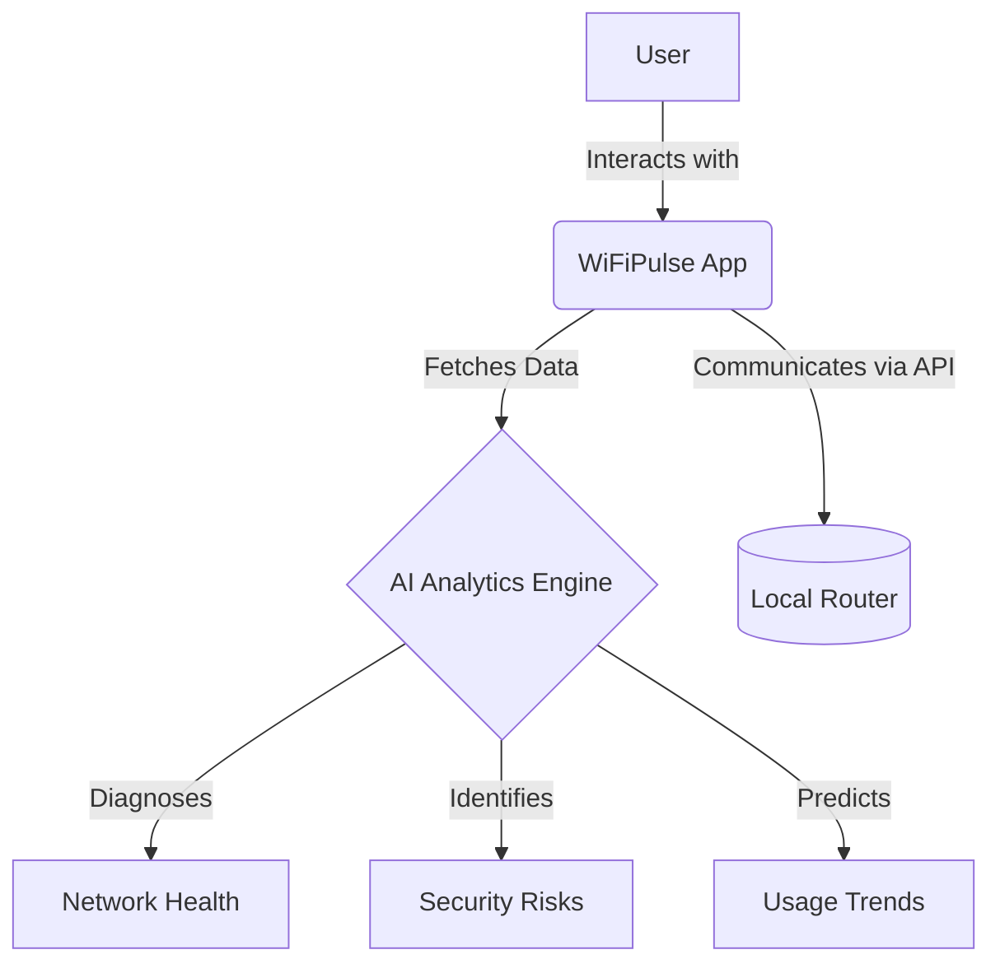
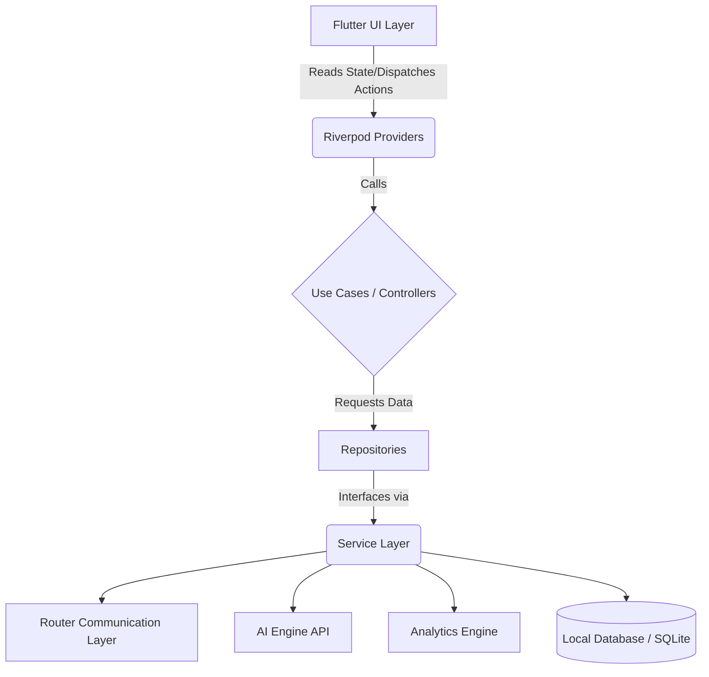
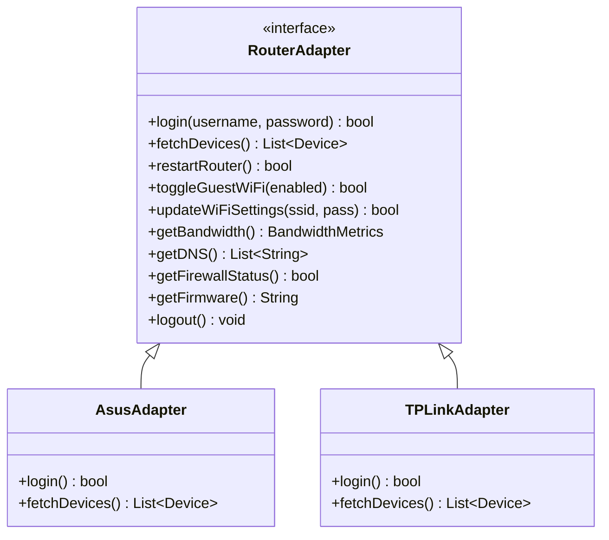
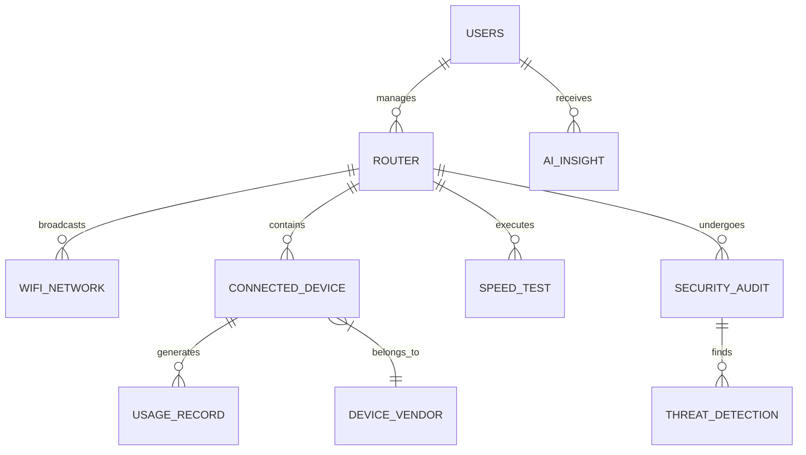

<div align="center">

# WiFiPulse
## Master Product Requirements Document
### Version 1.0

<br/>
<br/>

**Prepared By:** `[Placeholder: Author Name/Team]`<br/>
**Date:** `[Placeholder: YYYY-MM-DD]`<br/>
**Status:** `[Placeholder: Draft / Under Review / Approved]`<br/>

</div>

---

## Document Metadata

| Property | Details |
|----------|---------|
| **Document Owner** | `[Placeholder: Name/Role]` |
| **Product Manager** | `[Placeholder: Name]` |
| **Technical Lead** | `[Placeholder: Name]` |
| **Target Release** | `[Placeholder: Target Release Version]` |

## Revision History

| Version | Date | Author | Description of Changes |
|---------|------|--------|------------------------|
| 1.0 | 2026-06-30 | AI Assistant | Initial PRD Template Creation |
| 1.1 | 2026-06-30 | AI Assistant | Wrote PRD Chapter 1 (Sections 1-7) |
| 1.2 | 2026-06-30 | AI Assistant | Wrote PRD Chapter 2 (Product Strategy) |
| 1.3 | 2026-06-30 | AI Assistant | Wrote PRD Chapter 3 (Functional Requirements) |
| 1.4 | 2026-06-30 | AI Assistant | Wrote PRD Chapter 4 (UI/UX Design System) |
| 1.5 | 2026-06-30 | AI Assistant | Wrote PRD Chapter 5 (System Architecture) |
| 1.6 | 2026-06-30 | AI Assistant | Wrote PRD Chapter 6 (Database Design) |
| 1.7 | 2026-06-30 | AI Assistant | Wrote PRD Chapter 7 (Router Integration Strategy) |
## Approvals

| Name | Role | Date | Signature |
|------|------|------|-----------|
| `[Name]` | Product Manager | `[YYYY-MM-DD]` | `[Signature/Approved]` |
| `[Name]` | Engineering Lead | `[YYYY-MM-DD]` | `[Signature/Approved]` |

---

## Conventions & Guidelines

### Requirement ID Conventions
All requirements must be tracked using a unique identifier following this format: `[CATEGORY]-[NUMBER]`.
- **REQ-F-###**: Functional Requirements
- **REQ-NF-###**: Non-Functional Requirements
- **REQ-S-###**: Security Requirements
- **REQ-UI-###**: UI/UX Requirements

### Feature Numbering
Features are numbered hierarchically corresponding to their module (e.g., `Module 1.0`, `Feature 1.1`, `Sub-feature 1.1.1`).

### Priority Definitions
| Priority | Definition |
|----------|------------|
| **Critical** | Essential for product launch (P0). Product cannot ship without it. |
| **High** | Important feature (P1). Adds significant value but has workarounds. |
| **Medium** | Nice to have (P2). Improves UX but not strictly necessary for core function. |
| **Low** | Minimal impact (P3). Candidate for future releases. |

### Requirement Status Definitions
- **Proposed:** Initially drafted, pending review.
- **Approved:** Approved by stakeholders for implementation.
- **In Progress:** Currently under development.
- **Completed:** Developed, tested, and integrated.
- **Deferred:** Pushed to a future release phase.

---

## Table of Contents
1. [Executive Summary](#1-executive-summary)
2. [Product Vision](#2-product-vision)
3. [Mission Statement](#3-mission-statement)
4. [Problem Statement](#4-problem-statement)
5. [Solution Overview](#5-solution-overview)
6. [Product Goals](#6-product-goals)
7. [Non Goals](#7-non-goals)
8. [Target Audience](#8-target-audience)
9. [User Personas](#9-user-personas)
10. [Market Research](#10-market-research)
11. [Competitive Analysis](#11-competitive-analysis)
12. [Product Positioning](#12-product-positioning)
13. [SWOT Analysis](#13-swot-analysis)
14. [Feature Roadmap](#14-feature-roadmap)
15. [Functional Requirements](#15-functional-requirements)
16. [Non Functional Requirements](#16-non-functional-requirements)
17. [Information Architecture](#17-information-architecture)
18. [Feature Modules](#18-feature-modules)
19. [Technical Architecture](#19-technical-architecture)
20. [UI Design Principles](#20-ui-design-principles)
21. [Security Requirements](#21-security-requirements)
22. [AI Features](#22-ai-features)
23. [Router Integration Strategy](#23-router-integration-strategy)
24. [Database Design](#24-database-design)
25. [API Design](#25-api-design)
26. [Performance Requirements](#26-performance-requirements)
27. [Testing Strategy](#27-testing-strategy)
28. [Analytics](#28-analytics)
29. [Accessibility](#29-accessibility)
30. [Monetization Strategy](#30-monetization-strategy)
31. [Release Plan](#31-release-plan)
32. [Future Roadmap](#32-future-roadmap)
33. [Risks](#33-risks)
34. [Assumptions](#34-assumptions)
35. [Open Questions](#35-open-questions)
36. [Glossary](#36-glossary)

---

## 1. Executive Summary
WiFiPulse is a premium, AI-powered Wi-Fi intelligence platform designed exclusively for Android. It bridges the gap between complex network administration and everyday user experience by offering an intuitive, aesthetically stunning application for managing, analyzing, and securing home networks. By leveraging on-device analytics and AI-driven insights, WiFiPulse empowers users to optimize their connectivity, detect security vulnerabilities, and control connected devices without requiring advanced technical knowledge.

## 2. Product Vision
To be the definitive command center for the modern connected home, transforming invisible network data into actionable, easy-to-understand intelligence that guarantees secure and seamless digital experiences for every user.

## 3. Mission Statement
To deliver a flawless, high-performance Android application that abstracts the complexity of router management and network diagnostics into a beautiful, Material 3 interface, providing users with unprecedented visibility and control over their Wi-Fi environments.

## 4. Problem Statement
Home networks are becoming increasingly congested and vulnerable due to the proliferation of IoT devices. However, traditional network management tools and ISP-provided router applications are often fragmented, visually outdated, and overwhelmingly technical. Users struggle to identify why their internet is slow, who is connected to their network, or whether their network is secure, leading to frustration and unresolved connectivity issues.

## 5. Solution Overview
WiFiPulse provides a unified, mobile-first solution that automatically discovers and connects to the user's local router. 



The platform offers real-time dashboards for speed, usage, and device tracking, coupled with an AI analytics engine that proactively diagnoses network bottlenecks and security risks, presenting solutions in plain language.

## 6. Product Goals
- **G-1:** Achieve a cold startup time of under 2 seconds to ensure immediate access to network controls.
- **G-2:** Deliver a frictionless onboarding experience that successfully detects and connects to standard home routers with zero manual configuration.
- **G-3:** Provide proactive AI-driven alerts for unusual network activity or unauthorized device connections.
- **G-4:** Establish a premium visual identity that rivals top-tier consumer applications, measured by high user retention and aesthetic satisfaction scores.

## 7. Non Goals
- **NG-1:** We will not build custom router hardware; WiFiPulse is strictly a software platform interfacing with existing consumer routers.
- **NG-2:** We will not support iOS or Web platforms in the initial V1 release to maintain a laser focus on Android excellence.
- **NG-3:** We will not provide enterprise-grade B2B network management features (e.g., multi-site SDN management).

## 8. Target Audience
### Primary Users
Everyday smartphone users who experience home network issues (buffering, dead zones) but lack the technical expertise to diagnose them using traditional router interfaces.

### Secondary Users
Parents and household managers needing visibility into network usage, connected devices, and basic parental controls to manage screen time and ensure digital safety.

### Enterprise Users
Remote workers and small office administrators who require enterprise-grade reliability, security monitoring, and uptime guarantees for critical professional communications.

### Geographic Scope
Global release, with initial localization in English. The application is designed to be hardware-agnostic, supporting standard ISP-provided routers globally.

## 9. User Personas

### 1. The Student
- **Background:** College student sharing an apartment with multiple roommates.
- **Goals:** Ensure stable connection for online classes and streaming.
- **Pain Points:** Frequent bandwidth throttling when roommates download large files; unable to access router admin panels.
- **Technical Skill:** Moderate to High.
- **WiFi Usage Pattern:** High streaming, gaming, and video conferencing.
- **Key Features Needed:** Device discovery, bandwidth hogs identification, speed test.

### 2. The Family/Home User
- **Background:** Parent managing a household with 10+ smart devices (phones, TVs, tablets).
- **Goals:** Keep the family safe online and manage screen time.
- **Pain Points:** Overwhelmed by technical jargon; worried about strangers accessing the network.
- **Technical Skill:** Low.
- **WiFi Usage Pattern:** General browsing, streaming, smart home automation.
- **Key Features Needed:** One-tap security audit, unknown device alerts, intuitive usage dashboards.

### 3. The Gamer
- **Background:** Competitive online gamer heavily reliant on low latency.
- **Goals:** Absolute minimum ping and zero packet loss.
- **Pain Points:** Intermittent lag spikes ruining competitive matches; lack of QoS (Quality of Service) controls.
- **Technical Skill:** High.
- **WiFi Usage Pattern:** Continuous low-latency data streams.
- **Key Features Needed:** Real-time latency tracking, AI-driven bottleneck diagnosis, offline support.

### 4. The Remote Worker
- **Background:** Professional working from home full-time, relying on VPNs and Zoom.
- **Goals:** 99.9% uptime during business hours; secure connection to corporate networks.
- **Pain Points:** Unpredictable dropouts during critical meetings; security compliance requirements.
- **Technical Skill:** Moderate.
- **WiFi Usage Pattern:** Heavy upload/download, constant video conferencing.
- **Key Features Needed:** Security monitoring, usage analytics, network stability scoring.

### 5. The Small Office
- **Background:** Manager of a small business or co-working space.
- **Goals:** Provide reliable guest Wi-Fi while keeping internal assets secure.
- **Pain Points:** Managing multiple access points; identifying rogue devices.
- **Technical Skill:** Moderate.
- **WiFi Usage Pattern:** High concurrent connections.
- **Key Features Needed:** Multi-router management, detailed usage analytics, AI insights.

### 6. The Network Enthusiast
- **Background:** Tech hobbyist running custom router firmware and smart home labs.
- **Goals:** Maximum visibility into packet routing, signal strength, and channel interference.
- **Pain Points:** Consumer apps abstract too much data, offering no real diagnostic value.
- **Technical Skill:** Expert.
- **WiFi Usage Pattern:** Extreme (IoT networks, NAS servers, homelabs).
- **Key Features Needed:** Advanced router management, deep AI insights, raw diagnostic data export.

## 10. Market Research
The home WiFi landscape is undergoing a massive transformation driven by the exponential growth of connected devices.
- **Growth of Home WiFi:** The transition to remote work and 4K/8K streaming has made robust home WiFi a utility as essential as electricity.
- **Connected Device Trends:** The average household now manages upwards of 15-20 connected devices, creating complex, multi-layered network environments that are highly susceptible to interference and bandwidth starvation.
- **Smart Home Adoption:** As IoT adoption accelerates, the attack surface for home networks expands. Users are increasingly aware of vulnerabilities but lack the tools to audit their smart home ecosystem.
- **Need for Network Visibility:** Traditional ISP routers provide "black box" experiences. When internet fails, users instinctively blame the ISP, unaware that the issue is often local channel interference or a specific bandwidth-hogging device.
- **AI-Assisted Networking:** The market is shifting from reactive diagnostics (user runs a speed test after lag occurs) to proactive AI-assisted networking (the system predicts lag based on historical usage and suggests channel switching).

## 11. Competitive Analysis

| Feature | WiFiPulse | Fing | WiFiman | Google Home | TP-Link Tether | Net Analyzer | Aruba Utilities |
|---------|-----------|------|---------|-------------|----------------|--------------|-----------------|
| **Device Discovery** | High | High | High | Low | Medium | High | High |
| **Usage Analytics** | High | Low | Low | Medium | Low | Low | Low |
| **AI Insights** | High | None | None | None | None | None | None |
| **Router Management**| High | None | None | High (Google Only) | High (TP-Link Only) | None | None |
| **Speed Test** | High | High | High | High | Low | None | Low |
| **Security Monitoring**| High | Medium| Low | Low | Low | Low | Low |
| **Offline Support** | High | Low | Medium| Low | Low | Low | Medium|

## 12. Product Positioning
WiFiPulse is fundamentally different from existing network tools. It is not just a passive WiFi scanner or a walled-garden router companion app. WiFiPulse is an **AI-powered WiFi Intelligence Platform**. 

While competitors like Fing offer raw network mapping and Net Analyzer offers technical diagnostics, they require the user to interpret the data. Conversely, apps like Google Home or TP-Link Tether offer great UX but are strictly locked to proprietary hardware. WiFiPulse bridges this gap by remaining hardware-agnostic, providing deep technical diagnostics, and crucially, utilizing AI to interpret that data into actionable, plain-English advice for the everyday user.

## 13. SWOT Analysis

### Strengths
- **AI-Driven Insights:** Differentiates the product from passive scanners by providing proactive solutions.
- **Hardware Agnostic:** Works across various router brands, avoiding vendor lock-in.
- **Premium UX:** Material 3 design provides a modern, trustworthy interface lacking in technical competitor apps.
- **Offline Support:** Core diagnostic features function even when the external internet is down.

### Weaknesses
- **API Limitations:** Deep router management depends on the availability and openness of specific router APIs.
- **Resource Intensive:** On-device AI analytics and continuous background monitoring may impact battery life.

### Opportunities
- **ISP Partnerships:** Potential to white-label the software for smaller ISPs lacking a premium mobile app.
- **Smart Home Integration:** Future integrations with Matter and Thread protocols to manage local IoT ecosystems directly.
- **Freemium Upsell:** Strong potential for monetizing advanced AI security audits or historical data retention.

### Threats
- **ISP Walled Gardens:** Major ISPs increasingly locking down local router access to force users into their proprietary apps.
- **OS Restrictions:** Android networking API restrictions (e.g., MAC address randomization, strict location permissions) complicating device discovery.
- **Incumbent Dominance:** Well-established apps like Fing possess massive existing install bases.

## 14. Feature Roadmap
> `[Placeholder: Provide a high-level timeline or phased release schedule of major features.]`

## 15. Functional Requirements (Chapter 3)

### Module 1: Authentication
- **Objective:** Securely authenticate users and manage their session state.
- **Description:** Provides the entry point into the application, supporting secure login, registration, password recovery, and guest access without forcing immediate account creation.
- **User Story:** As a new user, I want to create an account or continue as a guest so that I can securely manage my local network without unnecessary friction.
- **Functional Requirements:**
  - `REQ-F-010`: The app shall display a branded Splash screen for 2 seconds.
  - `REQ-F-011`: The app shall provide an Onboarding flow for first-time users.
  - `REQ-F-012`: The system shall allow Login via email/password and Google OAuth.
  - `REQ-F-013`: The system shall provide a Registration form with password strength validation.
  - `REQ-F-014`: The system shall support a Forgot Password flow via email reset.
  - `REQ-F-015`: The system shall allow a Guest Mode with limited cloud-sync features.
  - `REQ-F-016`: The system shall handle Session Management (token refresh, auto-logout on expiration).
  - `REQ-F-017`: The user shall be able to Logout from the settings menu.
- **Non-functional Requirements:** Authentication state must resolve in < 500ms from cache. Passwords must never be stored locally in plaintext.
- **User Flow:** Splash -> Onboarding -> Auth Gateway -> (Login / Register / Guest) -> Dashboard.
- **Edge Cases:** Network timeout during login; expired auth tokens requiring silent refresh; invalid credentials.
- **Permissions Required:** Internet access.
- **Dependencies:** Firebase Auth API, Secure Storage.
- **Future Enhancements:** Biometric login (Fingerprint/FaceID).
- **Acceptance Criteria:** User can successfully log in, remain authenticated across app restarts, and securely log out.

### Module 2: Dashboard
- **Objective:** Provide a centralized, real-time overview of the network's health.
- **Description:** The primary landing screen showing the current connected network, internet status, live traffic, and recent alerts.
- **User Story:** As a home user, I want to see a summary of my network's health as soon as I open the app so I know if everything is working correctly.
- **Functional Requirements:**
  - `REQ-F-020`: The dashboard shall display a Network Summary (SSID, BSSID).
  - `REQ-F-021`: The dashboard shall display Router Information (IP, Gateway).
  - `REQ-F-022`: The dashboard shall indicate live Internet Status (Online/Offline).
  - `REQ-F-023`: The dashboard shall show the Connected Device Count.
  - `REQ-F-024`: The dashboard shall display current Upload Speed and Download Speed.
  - `REQ-F-025`: The dashboard shall display current Ping/Latency.
  - `REQ-F-026`: The dashboard shall summarize Today's Usage in MB/GB.
  - `REQ-F-027`: The dashboard shall feature a Live Graph visualizing real-time bandwidth consumption.
  - `REQ-F-028`: The dashboard shall provide Quick Actions (e.g., Scan, Speed Test).
  - `REQ-F-029`: The dashboard shall display active Alerts and Recent Activity logs.
- **Non-functional Requirements:** Live graphs must render at 60fps and update every 1 second without draining the battery.
- **User Flow:** Successful Login -> Dashboard -> (Taps on metrics to navigate to detailed modules).
- **Edge Cases:** Phone connected to mobile data instead of WiFi; router reachable but internet down.
- **Permissions Required:** Location (required for Android to read SSID), Network State.
- **Dependencies:** Device Discovery Module, Usage Analytics Module.
- **Future Enhancements:** Customizable dashboard widgets.
- **Acceptance Criteria:** Dashboard accurately reflects the currently connected WiFi network and updates live metrics smoothly.

### Module 3: Device Discovery
- **Objective:** Identify and catalog every device connected to the local network.
- **Description:** Scans the local subnet to detect active devices, resolving MAC addresses, IP addresses, and identifying the vendor and device type.
- **User Story:** As an admin, I want to see a list of all devices on my network so I can identify unauthorized users.
- **Functional Requirements:**
  - `REQ-F-030`: The app shall Scan Network subnets (e.g., 192.168.1.x) for active hosts.
  - `REQ-F-031`: The system shall perform Device Detection via ARP/Ping sweeps.
  - `REQ-F-032`: The system shall attempt Device Type Identification (Phone, TV, PC).
  - `REQ-F-033`: The system shall perform Vendor Detection by resolving MAC Address OUI prefixes.
  - `REQ-F-034`: The system shall display the IPv4/IPv6 Address of each device.
  - `REQ-F-035`: The system shall resolve the local Hostname of devices.
  - `REQ-F-036`: The system shall flag Unknown Devices that do not match historical records.
  - `REQ-F-037`: The user shall be able to assign Device Nicknames.
  - `REQ-F-038`: The system shall automatically or manually assign Device Icons.
  - `REQ-F-039`: The system shall maintain a Device History of previously seen devices.
- **Non-functional Requirements:** Network scan must complete within 15 seconds for a standard /24 subnet.
- **User Flow:** Dashboard -> "Scan Network" -> Progress Indicator -> List of Devices -> Device Detail View.
- **Edge Cases:** Devices blocking ICMP ping; MAC address randomization on modern smartphones.
- **Permissions Required:** Local Network Access, WiFi State.
- **Dependencies:** OUI Database lookup service.
- **Future Enhancements:** Bonjour/mDNS scanning for deep device profiling.
- **Acceptance Criteria:** App correctly lists active devices with accurate IP and vendor information within 15 seconds.

### Module 4: Usage Analytics
- **Objective:** Track and visualize data consumption across the network.
- **Description:** Monitors bandwidth consumption, identifying trends, top consumers, and historical usage patterns.
- **User Story:** As a parent, I want to see which device is using the most data today so I can pause a heavy download during work hours.
- **Functional Requirements:**
  - `REQ-F-040`: The system shall track Per Device Usage (if supported by router API).
  - `REQ-F-041`: The system shall display Hourly Usage graphs.
  - `REQ-F-042`: The system shall display Daily Usage summaries.
  - `REQ-F-043`: The system shall display Weekly Usage trends.
  - `REQ-F-044`: The system shall display Monthly Usage totals.
  - `REQ-F-045`: The system shall provide Live Monitoring of current throughput.
  - `REQ-F-046`: The system shall display a Usage Timeline of significant data events.
  - `REQ-F-047`: The system shall identify Top Consumers (devices using the most data).
  - `REQ-F-048`: The system shall provide a Usage Forecast for the billing cycle.
  - `REQ-F-049`: The user shall be able to generate exportable Usage Reports.
- **Non-functional Requirements:** Analytics database must efficiently aggregate millions of data points without UI lag.
- **User Flow:** Dashboard -> Analytics Tab -> Select Timeframe -> View Top Consumers.
- **Edge Cases:** Router API does not expose per-device metrics; data counter resets on router reboot.
- **Permissions Required:** None directly (depends on router API access).
- **Dependencies:** Router Management Module.
- **Future Enhancements:** Deep packet inspection (DPI) category analysis (e.g., streaming vs. gaming).
- **Acceptance Criteria:** App accurately charts historical data usage and identifies high-bandwidth devices.

### Module 5: Speed Test
- **Objective:** Accurately measure the internet connection's raw throughput and latency.
- **Description:** A built-in testing suite to measure ping, jitter, download, and upload speeds against external servers.
- **User Story:** As a gamer, I want to test my ping and jitter to ensure my connection is stable before playing a competitive match.
- **Functional Requirements:**
  - `REQ-F-050`: The user shall be able to trigger a Manual Test.
  - `REQ-F-051`: The system shall support scheduled Automatic Tests in the background.
  - `REQ-F-052`: The test shall measure ICMP Ping latency to a nearest server.
  - `REQ-F-053`: The test shall calculate Jitter (variance in ping).
  - `REQ-F-054`: The test shall estimate Packet Loss percentage.
  - `REQ-F-055`: The test shall measure Download speed in Mbps.
  - `REQ-F-056`: The test shall measure Upload speed in Mbps.
  - `REQ-F-057`: The system shall maintain a Test History log for trend analysis.
- **Non-functional Requirements:** Speed test must accurately saturate the connection without crashing the app; minimal memory footprint.
- **User Flow:** Dashboard -> Speed Test -> "Go" -> Gauge Animation -> Results Summary -> Save to History.
- **Edge Cases:** Network disconnects mid-test; ISP throttles speed test servers.
- **Permissions Required:** Internet Access.
- **Dependencies:** External speed test API/infrastructure (e.g., M-Lab, Ookla).
- **Future Enhancements:** Local network speed test (device to router) vs. WAN speed test.
- **Acceptance Criteria:** Test accurately measures and records Ping, Download, and Upload speeds matching established benchmarks.

### Module 6: Security
- **Objective:** Identify and alert users to potential vulnerabilities on their local network.
- **Description:** Continuously monitors the network for unauthorized devices, weak encryption, and exposed ports.
- **User Story:** As a security-conscious user, I want to be alerted if my router has open ports or weak passwords so I can fix them.
- **Functional Requirements:**
  - `REQ-F-060`: The system shall issue an Unknown Device Alert when an unrecognized MAC address connects.
  - `REQ-F-061`: The system shall issue a New Login Alert when the router admin panel is accessed.
  - `REQ-F-062`: The system shall perform Weak Password Detection on the WiFi PSK (if known/provided).
  - `REQ-F-063`: The system shall perform Open Port Detection via UPnP or port scanning on the router IP.
  - `REQ-F-064`: The system shall calculate a Router Security Score (0-100).
  - `REQ-F-065`: The system shall detect the current WiFi Encryption standard (WEP/WPA2/WPA3).
  - `REQ-F-066`: The user shall be able to trigger a manual Security Audit.
  - `REQ-F-067`: The system shall maintain a Security Timeline of detected vulnerabilities and resolutions.
- **Non-functional Requirements:** Port scanning must be lightweight to avoid triggering ISP intrusion detection systems.
- **User Flow:** Dashboard -> Security Tab -> "Run Audit" -> View Score and Vulnerabilities -> Follow resolution steps.
- **Edge Cases:** Router blocks local port scanning; false positives on intentionally open ports (e.g., Plex).
- **Permissions Required:** Local Network Access.
- **Dependencies:** Device Discovery Module.
- **Future Enhancements:** Integration with known CVE databases for specific router firmware vulnerabilities.
- **Acceptance Criteria:** App successfully identifies WEP/WPA encryption and flags insecure configurations.

### Module 7: Router Management
- **Objective:** Provide direct control over router settings from within the app.
- **Description:** Interfaces with specific router APIs to allow users to change passwords, restart the router, and manage guest networks without using a web browser.
- **User Story:** As a home user, I want to restart my router from my phone when the internet is slow, without having to walk to the physical device.
- **Functional Requirements:**
  - `REQ-F-070`: The system shall maintain a directory of Supported Routers.
  - `REQ-F-071`: The system shall perform automatic Router Detection (Brand/Model).
  - `REQ-F-072`: The user shall be able to perform a Router Login via the app.
  - `REQ-F-073`: The user shall be able to issue a Restart Router command.
  - `REQ-F-074`: The system shall fetch a list of router-recognized Connected Clients.
  - `REQ-F-075`: The user shall be able to view and change the WiFi Name (SSID).
  - `REQ-F-076`: The user shall be able to perform a Password Update for the WiFi network.
  - `REQ-F-077`: The user shall be able to view and change the broadcasting Channel.
  - `REQ-F-078`: The user shall be able to configure custom DNS servers.
  - `REQ-F-079`: The user shall be able to toggle a Guest WiFi network on/off.
- **Non-functional Requirements:** Credentials must be stored securely using Keychain/Keystore. API calls must handle variable router response times.
- **User Flow:** Router Tab -> Enter Admin Credentials -> Authenticate -> Select "Restart" -> Confirm.
- **Edge Cases:** Router firmware updates changing the internal API; unsupported legacy routers.
- **Permissions Required:** Local Network Access.
- **Dependencies:** Reverse-engineered or official Router APIs (e.g., AsusWRT, TP-Link).
- **Future Enhancements:** Parental control scheduling (pausing internet for specific MAC addresses).
- **Acceptance Criteria:** User can successfully authenticate to a supported router and trigger a remote reboot.

### Module 8: AI Insights
- **Objective:** Translate raw network data into actionable, plain-English advice.
- **Description:** Analyzes network behavior to detect anomalies, suggest optimizations, and summarize complex data into digestible reports.
- **User Story:** As a non-technical user, I want the app to simply tell me *why* my Netflix is buffering and *how* to fix it.
- **Functional Requirements:**
  - `REQ-F-080`: The system shall generate a natural language AI Summary of network health.
  - `REQ-F-081`: The system shall generate a Daily Report of significant events.
  - `REQ-F-082`: The system shall generate a Weekly Report comparing week-over-week performance.
  - `REQ-F-083`: The system shall provide actionable Recommendations (e.g., "Change to Channel 6").
  - `REQ-F-084`: The system shall suggest Bandwidth Optimization strategies when usage peaks.
  - `REQ-F-085`: The system shall provide Device Suggestions (e.g., "Move your Smart TV to the 5GHz band").
  - `REQ-F-086`: The system shall trigger Smart Notifications for predictive failures.
  - `REQ-F-087`: The system shall use Predictive Analytics to forecast network congestion hours.
- **Non-functional Requirements:** AI generation must happen on-device where possible to preserve privacy, or via secure, anonymized API calls.
- **User Flow:** Dashboard -> "AI Insights" Card -> Read Summary -> Tap "Apply Fix" for automated resolution.
- **Edge Cases:** AI suggests a channel that is technically clear but suffers from non-WiFi interference (e.g., microwaves).
- **Permissions Required:** None directly.
- **Dependencies:** Backend LLM API or on-device ML models.
- **Future Enhancements:** Autonomous self-healing networks (app changes settings automatically).
- **Acceptance Criteria:** App successfully analyzes a simulated congested network and outputs a recommendation to change channels.

### Module 9: Notifications
- **Objective:** Alert users to critical network events in real-time.
- **Description:** A robust notification engine managing local, push, and email alerts based on user preferences.
- **User Story:** As a parent, I want a push notification immediately if a new device joins my network.
- **Functional Requirements:**
  - `REQ-F-090`: The system shall deliver OS-level Push Notifications.
  - `REQ-F-091`: The system shall display persistent In-app Alerts in a notification center.
  - `REQ-F-092`: The system shall be capable of sending Email Reports.
  - `REQ-F-093`: The system shall compile and send a Daily Summary notification.
  - `REQ-F-094`: The system shall compile and send a Weekly Summary notification.
  - `REQ-F-095`: The system shall bypass Do-Not-Disturb for specified Critical Alerts (e.g., network breach).
- **Non-functional Requirements:** Notifications must be delivered within 5 seconds of the triggering event.
- **User Flow:** Event occurs -> OS Push Notification -> User taps notification -> Opens specific app module.
- **Edge Cases:** User revokes notification permissions; background execution restricted by Android battery saver.
- **Permissions Required:** Post Notifications (Android 13+).
- **Dependencies:** Firebase Cloud Messaging (FCM).
- **Future Enhancements:** Webhook integrations (e.g., send alerts to Discord/Slack).
- **Acceptance Criteria:** App successfully requests notification permission and delivers a local alert when a new device is manually added to the database.

### Module 10: Settings
- **Objective:** Allow users to customize their application experience and manage their data.
- **Description:** Centralized configuration for UX, privacy, and data management.
- **User Story:** As a user, I want to switch the app to Dark Mode and export my data for my own records.
- **Functional Requirements:**
  - `REQ-F-100`: The user shall be able to toggle the app Theme (Light/Dark/System).
  - `REQ-F-101`: The user shall be able to select the application Language.
  - `REQ-F-102`: The user shall be able to toggle measurement Units (Mbps vs MB/s).
  - `REQ-F-103`: The user shall be able to configure granular Notification Settings.
  - `REQ-F-104`: The user shall be able to manage Privacy settings (opt out of analytics).
  - `REQ-F-105`: The user shall be able to Export Data (devices, history) to local storage.
  - `REQ-F-106`: The user shall be able to trigger a manual cloud Backup.
  - `REQ-F-107`: The user shall be able to Restore settings and history from a backup.
- **Non-functional Requirements:** Settings changes must apply instantaneously across the app without requiring a restart.
- **User Flow:** Profile Icon -> Settings -> Display -> Select "Dark Mode" -> UI updates immediately.
- **Edge Cases:** Storage full during export; network failure during backup.
- **Permissions Required:** Storage (if exporting directly to filesystem).
- **Dependencies:** Local Key-Value store (e.g., SharedPreferences).
- **Future Enhancements:** Cloud-synced settings across multiple devices.
- **Acceptance Criteria:** User can change the theme to Dark Mode and the selection persists upon app restart.

### Module 11: Reports
- **Objective:** Provide tangible, shareable records of network performance and security.
- **Description:** Generates formatted documents summarizing analytics, security, and AI insights.
- **User Story:** As a small office manager, I want to export a monthly PDF report of our network uptime to show to the business owner.
- **Functional Requirements:**
  - `REQ-F-110`: The system shall generate a formatted PDF Report.
  - `REQ-F-111`: The system shall generate a raw CSV Export for data analysts.
  - `REQ-F-112`: The system shall compile a comprehensive Monthly Report.
  - `REQ-F-113`: The system shall compile an AI Report detailing past recommendations and outcomes.
  - `REQ-F-114`: The system shall compile a Device Report listing all known MAC addresses.
  - `REQ-F-115`: The system shall compile a Security Report detailing audit scores over time.
- **Non-functional Requirements:** PDF generation must not block the main UI thread.
- **User Flow:** Analytics Tab -> "Generate Report" -> Select "PDF" -> Select "Last 30 Days" -> Share via OS Intent.
- **Edge Cases:** Attempting to generate a report with zero historical data.
- **Permissions Required:** Storage.
- **Dependencies:** PDF generation library.
- **Future Enhancements:** Scheduled automated emailing of reports.
- **Acceptance Criteria:** App successfully compiles a CSV of currently connected devices and opens the Android share sheet.

### Module 12: Offline Mode
- **Objective:** Ensure core functionality remains accessible even when WAN (Internet) access is down.
- **Description:** Graceful degradation of features when the local router cannot reach the internet, relying on local caching.
- **User Story:** As a user whose internet just dropped, I want to open the app and see my local network devices to figure out if my router is dead or just the ISP connection.
- **Functional Requirements:**
  - `REQ-F-120`: The system shall display Cached Devices from the local database when offline.
  - `REQ-F-121`: The system shall allow viewing of Cached Reports.
  - `REQ-F-122`: The system shall continue to collect Local Analytics (e.g., scanning the subnet) without internet.
  - `REQ-F-123`: The system shall display an Offline Dashboard clearly indicating WAN failure but LAN success.
- **Non-functional Requirements:** The app must not crash or show generic "Network Error" dialogs when attempting to load the dashboard without internet.
- **User Flow:** Internet drops -> User opens app -> Dashboard shows "No Internet" banner -> Local device scan still functions.
- **Edge Cases:** Cloud-only features (e.g., Speed Test, LLM AI Insights) gracefully disabled with clear messaging.
- **Permissions Required:** Network State.
- **Dependencies:** SQLite / Local Database.
- **Future Enhancements:** Peer-to-peer mesh syncing of device lists between instances of the app on the same LAN.
- **Acceptance Criteria:** App launches successfully in Airplane mode (with WiFi enabled) and displays the local device list from cache.

---

## Feature Priority Matrix

| Feature Module | Priority | Description |
|----------------|----------|-------------|
| **Dashboard** | Must Have | Essential landing page; core value proposition. |
| **Device Discovery** | Must Have | Core functionality; users must see what is on their network. |
| **Speed Test** | Must Have | Most common user action when diagnosing network issues. |
| **Authentication** | Must Have | Required for cloud sync and personalized settings. |
| **Settings** | Must Have | Required for basic app configuration (Theme, App preferences). |
| **Security** | Should Have | High value, but secondary to basic discovery and speed. |
| **Usage Analytics** | Should Have | Dependent on router API capabilities; high value if possible. |
| **Offline Mode** | Should Have | Crucial for a networking app, but complex to implement flawlessly. |
| **AI Insights** | Could Have | Differentiator, but requires stable data collection first. |
| **Notifications** | Could Have | Useful for proactive alerts, but not strictly necessary for MVP. |
| **Reports** | Could Have | Nice to have for power users/small offices. |
| **Router Management** | Won't Have (V1) | Extremely high effort due to fragmented proprietary APIs; deferred to later versions. |

## 16. Non Functional Requirements
> `[Placeholder: Detailed list of system performance, reliability, and usability requirements (REQ-NF-###).]`

## 17. Information Architecture
> `[Placeholder: Outline the application structure, navigation flow, and screen hierarchy.]`

## 18. Feature Modules
> `[Placeholder: Break down the application into discrete functional modules.]`

## 19. System Architecture (Chapter 5)

### 5.1 High-Level Architecture
WiFiPulse is built using a strict separation of concerns, ensuring that UI components are completely decoupled from network logic and business rules.

The application leverages **Flutter** for cross-platform UI rendering, **Riverpod** for reactive state management, and **Clean Architecture** combined with the **Repository Pattern** for data flow. 



Key Engines:
- **Router Communication Layer:** Handles specific API calls to various router brands.
- **AI Engine:** Processes historical data to generate plain-text insights.
- **Analytics Engine:** Aggregates bandwidth and usage data.
- **Notification Engine:** Dispatches critical alerts.
- **Export Engine:** Formats data into PDF/CSV reports.

### 5.2 Folder Structure
The project structure strictly adheres to feature-based organization combined with Clean Architecture layers.

```text
lib/
├── core/             # App-wide constants, themes, error handling, extensions
├── shared/           # Reusable UI widgets (buttons, cards) used across features
├── features/         # Feature modules containing Presentation, Domain, Data
│   ├── auth/         # Login, Register, Session Management
│   ├── dashboard/    # Main landing screen and telemetry summary
│   ├── devices/      # Device list and detailed device views
│   ├── discovery/    # Network scanning and ARP sweeping logic
│   ├── router/       # Router admin panel interfacing
│   ├── usage/        # Bandwidth monitoring and historical charts
│   ├── security/     # Port scanning, password auditing
│   ├── speed_test/   # External speed testing logic
│   ├── ai/           # LLM integration and insight generation
│   ├── notifications/# Alert center and push handling
│   ├── reports/      # PDF/CSV generation UI and logic
│   ├── settings/     # App configuration and preferences
│   └── sync/         # Cloud backup and restore logic
```

### 5.3 Clean Architecture
Every feature inside `lib/features/` follows this structure:

- **Presentation Layer (`presentation/`):** Contains Flutter Widgets, Pages, and Riverpod Notifiers. Knows *nothing* about how data is fetched.
- **Domain Layer (`domain/`):** Contains Entities (pure Dart objects), Repositories (Interfaces/Abstract classes), and Use Cases. The core business logic.
- **Data Layer (`data/`):** Contains Models (JSON serializable), Data Sources (Remote APIs, Local SQLite), and Repository Implementations.

**Communication Rules:**
- The Presentation layer can only depend on Domain.
- The Data layer can only depend on Domain.
- The Domain layer depends on *nothing* (Core Dart only).

### 5.4 State Management
WiFiPulse utilizes **Riverpod (2.x)** for all state management and dependency injection.

- **Provider Hierarchy:** Strict scoping. Global providers for services; auto-disposed providers for transient screen states.
- **Repository Providers:** Provide concrete implementations of domain interfaces.
- **Service Providers:** Singleton instances of external services (e.g., `routerServiceProvider`).
- **Notifier Providers (`Notifier<T>` / `AsyncNotifier<T>`):** Used for complex state mutations (e.g., `DeviceListNotifier`).
- **Future Providers:** Used for one-off asynchronous data fetching (e.g., `fetchDeviceDetailsProvider`).
- **Stream Providers:** Used for real-time telemetry (e.g., `liveSpeedProvider`).
- **Caching:** Handled automatically via Riverpod's `keepAlive` mechanics, with strict invalidation rules upon router disconnection.
- **Error Handling:** UI always maps `AsyncValue.error` to user-friendly widgets (Error States), preventing white screens of death.

### 5.5 Dependency Injection
- **Strategy:** Riverpod is the sole DI container. We do not use GetIt.
- **Lifecycle:** Services and Repositories are typically Global Providers (living for the duration of the app). State controllers are `autoDispose`.
- **Singletons:** Enforced by creating a standard `Provider` (e.g., `final dbProvider = Provider<Database>((ref) => ...)`).
- **Lazy Loading:** Riverpod inherently lazy-loads all dependencies upon first read.
- **Initialization Sequence:** Critical services (SharedPreferences, SQLite) are initialized in `main.dart` before `runApp`, and their instances are passed into `ProviderScope` via `overrides`.

### 5.6 Repository Pattern
Repositories act as the single source of truth for a domain.
- **Authentication:** `AuthRepository` (Firebase + Secure Storage).
- **Devices:** `DeviceRepository` (SQLite cache + live ARP scans).
- **Router:** `RouterRepository` (Brand-specific API implementations).
- **Analytics:** `AnalyticsRepository` (Aggregates raw usage data).
- **Usage:** `UsageRepository` (Handles time-series bandwidth data).
- **Security:** `SecurityRepository` (Manages audit histories and CVE checks).
- **Reports:** `ReportsRepository` (Manages saved files).
- **Notifications:** `NotificationRepository` (FCM tokens and local alert history).
- **AI:** `AIRepository` (Prompts and cached insights).
- **Settings:** `SettingsRepository` (Theme, units, preferences).

### 5.7 Service Layer
Services handle external I/O and hardware interaction, consumed by the Data Layer.
- **Router Service:** Adapters for TP-Link, Asus, Netgear APIs.
- **Speed Test Service:** Connects to M-Lab/Ookla infrastructure.
- **AI Service:** Communicates with remote LLM or local ML model.
- **Analytics Service:** Formats telemetry for backend processing.
- **Export Service:** Generates physical PDF/CSV files on device storage.
- **Notification Service:** Handles local OS notification channels.
- **Security Service:** Executes raw socket connections for port scanning.
- **Permission Service:** Manages OS-level permission requests and rationales.
- **Connectivity Service:** Monitors WAN/LAN network state changes.

### 5.8 Error Handling
- **Centralized Exception Handling:** All repository calls are wrapped in a generic `Result<T, Exception>` or mapped to UI-friendly `Failure` objects.
- **Custom Exceptions:** `NetworkFailure`, `AuthFailure`, `RouterAuthFailure`, `PermissionDeniedFailure`.
- **API Exceptions:** Handled at the Data Source level and transformed into Domain exceptions.
- **Router Exceptions:** Specific timeouts for slow router responses.
- **Offline Exceptions:** Trigger the Offline Strategy fallback gracefully.
- **Retry Policy:** Exponential backoff for non-destructive read operations (e.g., fetching usage logs).

### 5.9 Logging
- **Debug Logging:** Uses `logger` package with colored console output (Trace, Debug, Info, Warning, Error).
- **Production Logging:** Errors and exceptions are routed to Firebase Crashlytics.
- **Crash Reporting:** Non-fatal exceptions caught by Flutter's global error handler are logged.
- **Analytics Logging:** Screen views and critical flows (e.g., "Scan Completed") are sent to Firebase Analytics.
- **Privacy Rules:** MAC addresses, IP addresses, and SSIDs are **NEVER** logged to external crash reporters or analytics. They are strictly PII.

### 5.10 Performance
- **Lazy Loading:** Pagination for device history and security logs.
- **Caching:** Aggressive local caching of device vendors (OUI) to prevent repetitive API calls.
- **Memory Optimization:** Stream subscriptions are strictly cancelled on disposal to prevent memory leaks during continuous network monitoring.
- **Image Optimization:** SVG used for all vector icons; WebP for any raster graphics.
- **Network Optimization:** Batching analytics payloads to reduce radio wakeups.
- **Background Processing:** Heavy tasks (Network Scans, PDF Generation) use Dart `Isolates` to prevent main thread jank.

### 5.11 Offline Strategy
- **Local Database:** SQLite (via drift or sqflite) serves as the offline cache for historical data.
- **Cache Synchronization:** Read operations default to cache first, network second, unless explicitly refreshed.
- **Conflict Resolution:** Last-write-wins policy for device nicknames and settings.
- **Queue Management:** Offline actions (e.g., "Rename Device") are queued locally and executed when the router connection is restored.

### 5.12 Security Architecture
- **Authentication:** OAuth 2.0 via Firebase; no local password hashing required.
- **Secure Storage:** Sensitive data (Router Admin Passwords, API keys) are stored in `FlutterSecureStorage` (Keystore/Keychain).
- **Encrypted Preferences:** User settings are stored safely.
- **Certificate Pinning:** Implemented for all communication with our proprietary backend servers.
- **Router Credentials:** Stored strictly locally, never synced to the cloud.
- **Sensitive Data Handling:** RAM is cleared of passwords immediately after use. 

### 5.13 Scalability
- **Future Modules:** Clean Architecture allows adding an "IoT Management" module without touching "Speed Test".
- **Plugin System:** Router APIs are implemented as interfaces, allowing rapid addition of new router brand support.
- **Feature Flags:** Remote Config allows toggling experimental AI features on/off without app updates.
- **Enterprise Version:** Modular data sources allow swapping Firebase for an enterprise-hosted backend.
- **Multi-Router Support:** Repositories are designed to accept a `routerId`, paving the way for managing multiple homes.
- **Cloud Sync:** Abstracted repositories make it trivial to mirror SQLite data to Firestore in future updates.

### 5.14 Risks
- **Architecture Risks:** Over-engineering standard features leading to slow development velocity.
- **Mitigation Strategy:** Strict PR reviews enforcing pragmatism over theoretical perfection.
- **Technical Debt:** Skipping the Domain layer to save time during MVP development.
- **Maintainability:** High, provided the Riverpod provider graph remains documented and cyclomatic complexity is kept low.

---

### Architecture Principles
1. UI is dumb; it only reacts to state.
2. The Database is the single source of truth for offline data.
3. Errors are data, not crashes.
4. Privacy is default; PII never leaves the device unless explicitly synced by the user.

### Development Standards
- 100% adherence to `flutter lint`.
- All asynchronous methods must handle timeouts explicitly.

### Coding Standards
- Use `freezed` for immutable models and union types.
- Avoid `dynamic`; use strict typing.

### Folder Ownership
- **Tech Lead:** Controls `core/` and `domain/`.
- **Feature Teams:** Own specific `features/` modules.

## 20. UI/UX Design System (Chapter 4)

### 4.1 Design Philosophy
WiFiPulse is defined by the following core attributes:
- **Modern:** Utilizing the latest Android UI paradigms.
- **Premium:** Feeling like a high-end, paid application even in its free tier.
- **Fast:** Instantaneous UI responses with zero perceived lag.
- **Clean:** High signal-to-noise ratio; removing unnecessary clutter.
- **AI-first:** Putting intelligent insights front and center, rather than burying them in logs.
- **Material 3 Inspired:** Embracing dynamic colors, rounded corners, and expressive typography while maintaining a distinct brand identity.
- **Minimal:** Stripping away complex networking jargon in favor of clear, actionable data.
- **Professional:** Establishing trust through precise, consistent, and error-free design.
- **Network Intelligence Platform:** Designed not just as a tool, but as a proactive command center.

The overall design principle is **"Clarity through Abstraction."** The underlying network data is infinitely complex, but the UI must abstract that complexity into a binary state for the user: "Everything is fine" or "Here is what you need to fix."

### 4.2 Design Language
- **Minimalism:** Use whitespace aggressively to separate logical groups of information.
- **Spacious Layouts:** Avoid dense grids; favor single-column scrolling lists on mobile.
- **Rounded Components:** All cards, buttons, and dialogs use a standard `16dp` border radius to feel friendly and modern.
- **Floating Cards:** Core interactive elements sit on elevated surfaces.
- **Soft Shadows:** Use large spread, low opacity drop shadows (`0.05` to `0.1`) to create subtle depth without harsh contrast.
- **Glass Effects:** Use subtle blur (`BackdropFilter`) behind bottom navigation bars and floating action buttons for a premium feel.
- **Motion Philosophy:** Every interaction has a reaction. State changes should be animated, not instant.
- **Consistency Rules:** A button that performs a destructive action must *always* look the same, regardless of the screen.

### 4.3 Color System
*The application utilizes a custom dark-mode optimized palette with high-contrast neon accents.*

| Role | Color Name | Hex (Light) | Hex (Dark) |
|------|------------|-------------|------------|
| **Primary** | Pulse Blue | `#2962FF` | `#448AFF` |
| **Secondary** | Deep Purple | `#6200EA` | `#B388FF` |
| **Accent** | Neon Cyan | `#00E5FF` | `#18FFFF` |
| **Success** | Emerald | `#00C853` | `#69F0AE` |
| **Warning** | Amber | `#FFAB00` | `#FFD740` |
| **Danger** | Crimson | `#D50000` | `#FF5252` |
| **Info** | Sky Blue | `#0091EA` | `#40C4FF` |
| **Background** | Pure / Void | `#F8F9FA` | `#0A0A0A` |
| **Surface** | Card / Panel | `#FFFFFF` | `#1A1A1A` |

- **Text Colors:** Primary (`#121212` / `#FFFFFF`), Secondary (`#5F6368` / `#BDBDBD`), Tertiary (`#9E9E9E` / `#757575`).
- **Disabled Colors:** Background (`#E0E0E0` / `#333333`), Text (`#9E9E9E` / `#666666`).
- **Border Colors:** Subtle Outline (`#E0E0E0` / `#2C2C2C`).
- **Status Colors:** 
  - *Router Status:* Online (Emerald), Offline (Crimson), Warning (Amber).
  - *Internet Status:* Connected (Emerald), Dropping (Amber), Disconnected (Crimson).
  - *Security Status:* Secure (Emerald), Vulnerable (Crimson), Auditing (Info).
  - *AI Insight Colors:* Recommendations (Deep Purple), Anomalies (Amber).

### 4.4 Typography
- **Fonts:** **Inter** (Primary for all UI elements, prioritizing legibility) and **JetBrains Mono** (for raw data, IP addresses, and MAC addresses).
- **Heading Hierarchy:**
  - H1 (Screen Titles): `32sp`, Bold, `-1.0` letter spacing.
  - H2 (Section Headers): `24sp`, SemiBold, `-0.5` letter spacing.
  - H3 (Card Titles): `18sp`, Medium.
- **Body Hierarchy:**
  - Body 1 (Main Text): `16sp`, Regular, `1.5` line height.
  - Body 2 (Secondary Text): `14sp`, Regular, `1.4` line height.
- **Caption:** `12sp`, Medium (used for timestamps and small badges).
- **Button:** `14sp`, SemiBold, All Caps or Title Case (depending on platform norms).
- **Labels:** `12sp`, Bold, `1.0` letter spacing (used for overline labels).
- **Number Styles:** 
  - Dashboard Numbers (Speed Test results): `48sp`, Bold, JetBrains Mono.
- **Spacing Rules:** `8dp` minimum baseline grid for all typography elements.

### 4.5 Iconography
- **Icon Family:** **Material Symbols Rounded** (filled for active states, outlined for inactive).
- **Usage Rules:** Icons must always be accompanied by text labels unless universally understood (e.g., search magnifying glass).
- **Router Icons:** `router`, `wifi`, `wifi_tethering`.
- **Device Icons:** `smartphone`, `laptop_mac`, `tv`, `dns` (servers), `nest_cam_indoor`.
- **Security Icons:** `shield`, `gpp_good`, `gpp_bad`, `lock`, `vpn_key`.
- **Analytics Icons:** `monitoring`, `bar_chart`, `timeline`, `pie_chart`.
- **Notification Icons:** `notifications`, `notifications_active`, `warning`.
- **AI Icons:** `auto_awesome`, `smart_toy`, `psychology`.

### 4.6 Layout System
- **Grid:** 4-column grid on mobile, 8-column on tablets. `16dp` outer margins.
- **Margins:** `16dp` horizontal standard for all screens. `24dp` bottom padding above navigation bars.
- **Spacing:** `8dp` intra-component spacing, `16dp` inter-component spacing, `32dp` major section spacing.
- **Cards:** Full width minus `16dp` margins, `16dp` internal padding, `16dp` border radius.
- **Lists:** Edge-to-edge separators, `16dp` horizontal padding for list items, minimum `56dp` touch target height.
- **Bottom Sheets:** Modal sheets for complex interactions (e.g., Device Details). Rounded top corners (`24dp`).
- **Dialogs:** Used only for destructive actions or critical alerts.
- **Navigation:** Standard bottom navigation bar (`80dp` height) for top-level destinations.
- **Floating Action Buttons (FAB):** Used selectively for primary actions (e.g., "Run Scan" on Dashboard). Positioned at the bottom end.

### 4.7 Navigation System
- **Bottom Navigation:** Fixed to the bottom. Destinations: Dashboard, Devices, Security, Analytics.
- **Drawer:** Not used. All critical navigation is via Bottom Navigation or Profile icon in the App Bar.
- **Tabs:** Used for sub-navigation within a top-level destination (e.g., Security -> [Audit, Timeline]).
- **Nested Navigation:** Managed via GoRouter, maintaining state for each Bottom Nav tab.
- **Deep Linking:** Supported for all major screens (e.g., `wifipulse://devices/{mac_address}`).
- **Back Navigation:** Standard OS back button/gesture behavior. State is preserved when navigating back.

### 4.8 Animation System
- **Page Transitions:** Shared Axis (X-axis) for sibling screens, Fade Through for Bottom Nav changes, Container Transform for Card-to-Details.
- **Loading Animations:** Custom Lottie animations (pulsing WiFi wave) instead of generic spinners.
- **Device Scan Animation:** Radar-sweep overlay on a network map.
- **Speed Test Animation:** Real-time speedometer gauge with particle effects for data packets.
- **Dashboard Refresh Animation:** Liquid pull-to-refresh.
- **AI Processing Animation:** Shimmering gradient on the AI Insight card while generating text.
- **Success Animation:** Checkmark burst.
- **Error Animation:** Subtle horizontal shake.

### 4.9 Screen Catalog
1. **Splash:** Animated logo, brand loading.
2. **Onboarding:** 3-step carousel explaining features and requesting permissions.
3. **Authentication:** Login/Register gateway.
4. **Dashboard:** Main telemetry hub.
5. **Device List:** All discovered devices.
6. **Device Details:** Specific metrics and actions for a single MAC address.
7. **Router Details:** IP, Gateway, DNS, and remote management actions.
8. **Analytics:** Charts and historical data.
9. **Reports:** Export configuration and generated PDF list.
10. **Security:** Vulnerability score and open ports.
11. **AI Insights:** Chat-like interface for AI recommendations.
12. **Notifications:** Inbox for all system alerts.
13. **Speed Test:** Dedicated test UI.
14. **Settings:** App configuration, theme, and data management.
15. **Profile:** User account details and cloud sync status.
16. **Help:** FAQs and support contact.
17. **About:** Version info, licenses.
18. **Permissions:** Dedicated screen explaining *why* location/network permissions are needed before prompting the OS dialog.

### 4.10 Responsive Design
- **Small Phones (SE/Mini):** Stacked UI elements, slightly reduced typography scales.
- **Large Phones (Pro Max/Ultra):** Standard `16dp` margins, highly comfortable touch targets.
- **Foldables (Inner Screen):** 2-pane layout (List on left, Details on right).
- **Tablets (Landscape):** Persistent left-side navigation rail instead of Bottom Navigation. 3-pane layout for complex tasks.
- **Tablets (Portrait):** Similar to large phones but with multi-column grid utilization for cards.

### 4.11 Accessibility
- **Contrast:** All text and critical UI elements must pass WCAG 2.1 AA contrast ratios (4.5:1 for normal text).
- **Dynamic Text:** UI must scale gracefully up to 200% OS font size without breaking layouts.
- **Screen Reader:** All non-text interactive elements must have descriptive `Semantics` labels (e.g., `contentDescription`).
- **Color Blindness:** Never rely solely on color to convey state (e.g., a "Disconnected" state must have an icon/text, not just turn red).
- **Touch Targets:** Minimum `48x48dp` for all clickable elements.
- **Keyboard Navigation:** Support D-pad and Tab navigation for Android TV/Chromebook compatibility.
- **Accessibility Score Target:** 100% on Google Accessibility Scanner.

### 4.12 Empty States
- **Loading:** Skeleton screens mimicking the final layout shape.
- **No Internet:** "Offline Mode" graphic, showing cached data with a prominent "Reconnect" button.
- **No Devices:** "Scan your network" prompt with an illustration of a router.
- **No Router:** "Connect to WiFi" prompt if on cellular data.
- **No Reports:** "Generate your first report" call to action.
- **No Notifications:** "All clear!" illustration.

### 4.13 Error States
- **Network Failure:** Snackbars for transient errors; full-screen error states for critical data load failures.
- **Authentication Error:** Inline text field errors with specific reasons (e.g., "Password too short").
- **Router Unavailable:** "Cannot reach router admin panel" with troubleshooting steps (e.g., "Are you on the guest network?").
- **Permission Denied:** "We need location access to see your WiFi name" with a button linking to OS settings.
- **Speed Test Failed:** "Server unreachable, try again."
- **Unknown Error:** "Something went wrong" with an option to send a crash report.

### 4.14 Component Library
- **Buttons:** Primary (Filled, Pulse Blue), Secondary (Outlined), Text (For cancel actions).
- **Cards:** Elevated `2dp`, `16dp` radius, pure white/dark gray background.
- **Charts:** Line charts with gradient fills, Bar charts with rounded caps.
- **Progress Indicators:** Linear (at top of screen for global loading), Circular (for localized loading).
- **Badges:** Small colored dots on icons for unread notifications.
- **Avatars:** Circular placeholders for device manufacturer logos.
- **Search:** Sticky search bar with leading magnifying glass and trailing clear button.
- **Filter Chips:** Pill-shaped toggles for filtering device lists (e.g., "Online", "Unknown").
- **Dialogs:** Material 3 standard `28dp` radius.
- **Snackbars:** Floating at the bottom, `8dp` radius, dark background.
- **Bottom Sheets:** Used for all contextual menus instead of dropdowns.
- **Tables:** Used rarely, only for deep analytics exports.
- **Device Cards:** Horizontal layout: Avatar (Left), Name/IP (Center), Status Indicator (Right).
- **Usage Cards:** Vertical layout: Metric (Top), Sparkline chart (Bottom).
- **AI Cards:** Distinctive deep purple gradient background to differentiate from standard data.
- **Security Cards:** Collapsible sections detailing passed/failed audits.

---
### Complete UI Component Inventory
> `[Placeholder: Link to external Figma or internal asset library]`

### Design Tokens
> `[Placeholder: Link to JSON export of color/typography tokens for automated CI/CD synchronization]`

### Future UI Improvements
> `[Placeholder: Plans for dynamic themes based on router brand, AR network mapping, widget expansion]`

## 21. Security Requirements
> `[Placeholder: Detail encryption, authentication, authorization, and data protection rules (REQ-S-###).]`

## 22. AI Features
> `[Placeholder: Detail any AI/ML driven insights, automation, or analytics features.]`

## 23. Router Integration Strategy (Chapter 7)

### 7.1 Introduction
The **Router Engine** is the core bridge between WiFiPulse's UI and the physical network hardware. Its philosophy is built around being **modular, extensible, secure, and vendor-independent**.

WiFiPulse must support robust **local-only operation**, ensuring that network management does not break during internet outages. While future iterations may embrace cloud-assisted intelligence for aggregate analytics, the core interaction between the app and the router relies on direct, secure API calls over the LAN. 

To achieve this, the Router Engine utilizes a **plugin-based architecture**, allowing developers to write isolated adapters for specific router brands without affecting the core application logic.

### 7.2 Supported Router Vendors
The following vendors are planned for integration via dedicated plugins:

- **Airtel Xstream Fiber**
  - *Capabilities:* Basic device list, restart, WiFi name/password management.
  - *Known limitations:* Heavily locked-down firmware; limited bandwidth metrics.
  - *Authentication:* Token-based / Session Cookie.
  - *Future roadmap:* Deep integration with specific Nokia/Huawei OEM models provided by Airtel.

- **JioFiber**
  - *Capabilities:* Device list, guest WiFi, basic restart.
  - *Known limitations:* Proprietary API structure often changes with firmware updates.
  - *Authentication:* Token-based.
  - *Future roadmap:* Mesh node visibility.

- **TP-Link**
  - *Capabilities:* Full management (Device ban, QoS, Guest WiFi, usage stats).
  - *Known limitations:* Cloud-only accounts (Tether) complicate local-only login on newer models.
  - *Authentication:* Token Authentication / TP-Link Cloud OAuth.
  - *Future roadmap:* Full Omada SDN integration.

- **ASUS (AsusWRT)**
  - *Capabilities:* Comprehensive management, raw bandwidth data, AiMesh mapping.
  - *Known limitations:* Some models require SSH for deep analytics.
  - *Authentication:* Session Cookies / Token Authentication.
  - *Future roadmap:* VPN configuration management.

- **Netgear (Orbi/Nighthawk)**
  - *Capabilities:* Device list, WiFi settings, reboot.
  - *Known limitations:* SOAP-based API on older models is notoriously slow.
  - *Authentication:* Basic Authentication / Session.
  - *Future roadmap:* Armor security integration.

- **D-Link, Tenda, Mercusys**
  - *Capabilities:* Basic network management, reboot.
  - *Known limitations:* Unreliable APIs; often rely on HTML scraping.
  - *Authentication:* Basic Authentication / Session Cookies.
  - *Future roadmap:* Standardize scraping engines.

- **Huawei, Nokia (ISP Modems)**
  - *Capabilities:* Gateway IP, basic WiFi settings.
  - *Known limitations:* Highly variable based on ISP custom firmware.
  - *Authentication:* Digest / Basic Authentication.
  - *Future roadmap:* Auto-detection of ISP-specific lockouts.

- **Cisco, MikroTik, Ubiquiti, OpenWRT, DD-WRT**
  - *Capabilities:* Deep packet inspection, VLANs, SSH access.
  - *Known limitations:* Target audience is prosumer; APIs require complex configuration.
  - *Authentication:* Token (UniFi), SSH (MikroTik/OpenWRT).
  - *Future roadmap:* Prosumer "Advanced Mode" unlock within the app.

### 7.3 Router Discovery
Before authentication, the app must locate the router and identify its make/model.

- **Gateway Discovery:** Reading the default gateway from the device's current network configuration.
- **ARP Scan:** Sweeping the local subnet to build an initial MAC-to-IP table.
- **mDNS & SSDP & UPnP:** Listening for multicast broadcasts to identify smart routers (e.g., Google Nest, UPnP gateways).
- **DHCP:** Inspecting DHCP lease data (if accessible).
- **Hostname Discovery:** Resolving local IPs to hostnames via reverse DNS.
- **Vendor Fingerprinting:** Analyzing HTTP headers on the gateway IP (e.g., `Server: lighttpd/Asus`).
- **MAC OUI Lookup:** Identifying the router hardware manufacturer via its MAC prefix.
- **IPv4 / IPv6:** Full dual-stack discovery support.
- **Multiple Subnet Detection:** Handling complex environments with VLANs or secondary routers.

### 7.4 Router Authentication
Once discovered, the engine negotiates a session.

- **Supported Protocols:**
  - `HTTP` / `HTTPS`
  - `Basic Authentication`
  - `Digest Authentication`
  - `Token Authentication` (e.g., Bearer tokens)
  - `Session Cookies`
  - `JWT`
  - `OAuth` (Future, for cloud-managed routers like Eero).
- **Credential Storage Strategy:** Credentials are saved purely via `FlutterSecureStorage` using OS-level encryption. They are strictly localized to the device.
- **Re-authentication & Session Expiration:** The engine automatically detects 401/403 errors, attempts a silent re-login using stored credentials, and resumes the previous action without interrupting the user flow.

### 7.5 Router Adapter Architecture
To support the fragmented router ecosystem, the engine uses the **Adapter Design Pattern**.



Each vendor plugin must implement the `RouterAdapter` interface. If a router does not support a specific action (e.g., Guest WiFi), the adapter throws an `UnsupportedFeatureException`, which the UI gracefully handles by hiding the relevant button.

### 7.6 Device Discovery Engine
A secondary engine that maps the network independently of the router's API.

- **Fast Scan:** Quick ping sweep of the `/24` subnet.
- **Deep Scan:** Aggressive port scanning and protocol probing for detailed profiling.
- **ARP Cache:** Reading the local ARP table to map IP to MAC instantly.
- **Ping Sweep:** ICMP echo requests to discover silent devices.
- **Hostname Resolution:** Extracting names via mDNS/NetBIOS.
- **Vendor Detection:** OUI matching (e.g., `00:1A:11` -> `Google`).
- **Device Fingerprinting & OS Estimation:** Analyzing open ports and TTL values to guess the OS.
- **Device Classification:** Categorizing devices (Mobile, PC, IoT).
- **Duplicate Removal:** Merging duplicate IPs resolving to the same MAC.
- **Offline Detection:** Tracking devices that fail to respond to consecutive sweeps.

### 7.7 Device Intelligence
Once a device is discovered, the AI Engine attempts classification to display a recognizable icon and name.

- **Recognizable Categories:** Android, iPhone, Windows, macOS, Linux, Smart TV, Printer, Camera, IoT, Gaming Console, Tablet, Unknown.
- **Confidence Scoring:** Classification is assigned a confidence score (0-100%). E.g., An Apple OUI with open port 62078 (lockdown) is 99% likely an iPhone/iPad.

### 7.8 Network Topology
Visualizing the physical layout of the network.

- **Supported Nodes:** Gateway, Mesh nodes, Repeaters, Access Points, Extenders.
- **Logical Segments:** Guest Network, LAN, WAN, Internet.
- **Visual Topology Graph:** The UI will feature a node-based graph mapping devices to their specific access point (if the router API supports mesh mapping).

### 7.9 Router Configuration
Standardized models for configuring the router regardless of brand.

- **General:** SSID, Password, Firmware Version.
- **Radios:** Channel, Band (2.4 GHz, 5 GHz, 6 GHz).
- **Features:** Guest WiFi (toggle, password, limits), QoS (Quality of Service priorities).
- **Networking:** DHCP ranges, DNS servers, Static IP reservations.

### 7.10 Security Analysis
The engine actively audits the network for vulnerabilities.

- **Open Ports:** Scans the Gateway for exposed WAN management ports (e.g., 80, 443, 22).
- **Encryption:** Flags weak protocols (WEP, WPA, TKIP).
- **Weak Passwords:** Warns if the WiFi password is common or short.
- **Unknown Devices:** Triggers alerts for unrecognized MAC addresses.
- **Duplicate IP & Rogue Device:** Detects IP conflicts or unexpected secondary DHCP servers.
- **ARP Spoof Detection:** Monitors for changing MAC addresses on the Gateway IP.
- **Gateway Validation:** Ensures the gateway IP hasn't been hijacked.
- **DNS Hijack Detection:** Verifies that DNS requests are not being maliciously redirected.
- **Security Score:** An aggregated score based on the above factors.

### 7.11 Performance Monitoring
Standardized metrics collected across all supported routers.

- **Metrics:** Bandwidth (Mbps), Latency (ms), Packet Loss (%), Jitter (ms), Signal Quality (dBm/RSSI).
- **Network State:** Channel Congestion (identifying overlapping neighboring WiFi networks).
- **History:** Usage Timeline and Historical Trends stored locally in SQLite.

### 7.12 Future Enterprise Features
The architecture is designed to scale into B2B use cases.

- **Mesh Controller:** Managing multi-node setups directly.
- **Cloud Controller:** Remote configuration of routers when away from home.
- **Remote Router Access:** Secure tunneling.
- **Enterprise Dashboard:** Managing Multiple Routers across different physical locations.
- **Business WiFi:** Captive portal management.
- **Office Analytics:** Deep traffic inspection.

### 7.13 Risks
- **Router Compatibility:** Highly fragmented market; old models may drop support for APIs.
- **Firmware Changes:** A firmware update can break the adapter, requiring rapid plugin updates.
- **Authentication Failures:** Aggressive scanning might trigger router anti-DDoS protections, locking out the app.
- **Privacy:** Collecting deep network metrics requires absolute transparency with the user.
- **Vendor Limitations:** Many ISPs actively block third-party local APIs to force usage of their own apps.
- **Security:** Storing router credentials requires flawless encryption implementation.

---

### Router Engine Principles
1. Do no harm: Never alter a router configuration without explicit user consent.
2. Read-only by default: Authenticate only when a change is requested, or when deep metrics are needed.
3. Fallback gracefully: If the Router API is unreachable, fallback to standard ARP/Ping network mapping.

### Plugin Development Guidelines
- Adapters must implement the interface exactly.
- HTTP scraping is allowed only if an API does not exist.
- Hardcoded delays/sleeps are forbidden; use reactive polling.

### Future Vendor Expansion Strategy
Create an open-source adapter repository allowing the community to submit plugins for obscure or regional ISP routers, dynamically loaded by the main application.

## 24. Database Design (Chapter 6)

### 6.1 Database Overview
WiFiPulse utilizes a **local-first architecture**. Network diagnostics and analytics must be available even when the external internet connection (WAN) goes down. Relying exclusively on cloud storage would render the app useless during outages—exactly when users need it most.

- **SQLite (via Drift):** The primary relational database for complex queries, time-series usage analytics, and offline caching of device logs. Drift provides type-safe SQL and reactive streams.
- **Hive:** Not used. We standardize on SQLite for all structural data to avoid fragmentation.
- **SharedPreferences:** Used strictly for non-sensitive, primitive key-value pairs (e.g., Theme preference, First Launch flag).
- **Secure Storage (FlutterSecureStorage):** Used for all sensitive credentials (OAuth tokens, Router Admin passwords).

### 6.2 Entity Relationship Model



### 6.3 Authentication Tables
- **Users:** `user_id` (PK), `email`, `display_name`, `created_at`, `last_login`.
- **Guest Sessions:** `session_id` (PK), `device_uuid`, `created_at`.
- **Login History:** `log_id` (PK), `user_id` (FK), `ip_address`, `timestamp`, `status`.
- **OAuth Accounts:** `oauth_id` (PK), `user_id` (FK), `provider` (Google/Apple), `provider_id`.
- **Session Tokens:** `token_id` (PK), `user_id` (FK), `expires_at` (stored in secure storage, mapped here for auditing).

### 6.4 Router Tables
- **Router:** `router_id` (PK), `user_id` (FK), `mac_address`, `brand`, `model`, `firmware_version`.
- **Router Configuration:** `config_id` (PK), `router_id` (FK), `ip_address`, `gateway`, `subnet_mask`.
- **Router Credentials:** `cred_id` (PK), `router_id` (FK), `username`, `password_reference` (maps to Secure Storage).
- **WiFi Networks:** `network_id` (PK), `router_id` (FK), `ssid`, `bssid`, `band` (2.4/5/6GHz), `channel`, `encryption_type`.
- **Guest Networks:** `guest_net_id` (PK), `router_id` (FK), `ssid`, `is_active`, `time_limit`.

### 6.5 Device Tables
- **Connected Device:** `device_id` (PK), `mac_address` (Unique), `router_id` (FK), `current_ip`, `hostname`, `first_seen`, `last_seen`.
- **Known Device:** `known_id` (PK), `device_id` (FK), `custom_name`, `icon_id`, `category`.
- **Blocked Device:** `block_id` (PK), `device_id` (FK), `blocked_at`, `reason`.
- **Trusted Device:** `trust_id` (PK), `device_id` (FK), `trusted_by_user_id` (FK).
- **Device History:** `history_id` (PK), `device_id` (FK), `event_type` (connect/disconnect), `timestamp`.
- **Device Vendor:** `oui` (PK), `vendor_name`, `country`.

### 6.6 Usage Tables
- **Usage Record:** `record_id` (PK), `device_id` (FK), `bytes_uploaded`, `bytes_downloaded`, `timestamp`.
- **Hourly Usage:** `hourly_id` (PK), `router_id` (FK), `hour`, `total_up`, `total_down`.
- **Daily Usage:** `daily_id` (PK), `router_id` (FK), `date`, `total_up`, `total_down`.
- **Weekly Usage:** `weekly_id` (PK), `router_id` (FK), `week_start`, `total_up`, `total_down`.
- **Monthly Usage:** `monthly_id` (PK), `router_id` (FK), `month`, `year`, `total_up`, `total_down`.
- **Bandwidth Forecast:** `forecast_id` (PK), `router_id` (FK), `projected_usage`, `confidence_score`.

### 6.7 Speed Test Tables
- **Speed Test:** `test_id` (PK), `router_id` (FK), `timestamp`, `server_name`, `server_location`.
- **Ping:** `test_id` (FK), `latency_ms`.
- **Jitter:** `test_id` (FK), `jitter_ms`.
- **Packet Loss:** `test_id` (FK), `loss_percentage`.
- **Historical Results:** Materialized view of `Speed Test` aggregated by week for chart rendering.

### 6.8 Security Tables
- **Security Audit:** `audit_id` (PK), `router_id` (FK), `timestamp`, `overall_score`.
- **Threat Detection:** `threat_id` (PK), `audit_id` (FK), `severity` (Low/Med/High), `description`.
- **Unknown Devices:** Maps to `Connected Device` where `trust_id` is null.
- **Alerts:** `alert_id` (PK), `threat_id` (FK), `is_dismissed`, `timestamp`.
- **Security Score:** `score_id` (PK), `router_id` (FK), `score`, `calculated_at`.

### 6.9 Notification Tables
- **Notification:** `notification_id` (PK), `user_id` (FK), `title`, `body`, `type` (Security/Usage/System), `timestamp`.
- **Read Status:** `notification_id` (PK/FK), `is_read`, `read_at`.
- **Notification Settings:** `setting_id` (PK), `user_id` (FK), `push_enabled`, `email_enabled`, `critical_only`.
- **Delivery Log:** `log_id` (PK), `notification_id` (FK), `delivery_status`, `timestamp`.

### 6.10 AI Tables
- **AI Insight:** `insight_id` (PK), `router_id` (FK), `category`, `summary_text`, `created_at`.
- **AI Recommendation:** `recommendation_id` (PK), `insight_id` (FK), `actionable_step`, `is_applied`.
- **AI Report:** `report_id` (PK), `router_id` (FK), `full_markdown`, `generated_at`.
- **Prediction Cache:** `prediction_id` (PK), `metric` (e.g., congestion time), `predicted_value`, `expires_at`.

### 6.11 Report Tables
- **PDF Reports:** `pdf_id` (PK), `file_path`, `generated_at`, `size_bytes`.
- **CSV Exports:** `csv_id` (PK), `file_path`, `generated_at`, `record_count`.
- **Generated Reports:** `report_id` (PK), `type` (PDF/CSV), `trigger` (Manual/Auto).
- **Sharing History:** `share_id` (PK), `report_id` (FK), `shared_via`, `timestamp`.

### 6.12 Settings Tables
*(Note: Often mapped via Key-Value store rather than strict relational tables, but modeled here for completeness if synced)*
- **Theme:** `light`, `dark`, `system`.
- **Language:** Locale strings (e.g., `en_US`).
- **Units:** `mbps`, `MB/s`.
- **Preferences:** `auto_scan_enabled`, `analytics_opt_in`.
- **Permissions:** Record of when user granted Location/Network access.

### 6.13 Cache Tables
- **API Cache:** `request_hash` (PK), `response_body`, `expires_at`.
- **Router Cache:** Brand-specific API responses that don't change frequently (e.g., supported features).
- **Device Cache:** Temporary holding table for devices detected during an active scan before merging into `Connected Device`.
- **Analytics Cache:** Un-synced events waiting for cloud upload.

### 6.14 Indexing Strategy
- **Primary Keys:** Standard auto-incrementing integers or UUIDs depending on sync requirements.
- **Indexes:** Applied heavily to `mac_address`, `timestamp`, and `router_id` to speed up chart rendering.
- **Foreign Keys:** Enforced to prevent orphaned records (e.g., deleting a router deletes its devices via `CASCADE`).
- **Composite Keys:** Used in junction tables (e.g., `Read Status`).
- **Performance Considerations:** Time-series data (`Usage Record`) must be aggressively indexed by time and device to prevent UI thread lock during aggregation.

### 6.15 Data Lifecycle
- **Creation:** Records created locally; queued for sync if cloud enabled.
- **Updates:** Last-write-wins policy based on `updated_at` timestamps.
- **Deletion:** Soft deletes (`is_deleted = true`) used for syncable records to propagate deletions.
- **Archival:** Raw `Usage Record` rows older than 30 days are rolled up into `Daily Usage` and the raw rows are purged.
- **Cache Expiration:** API caches cleared based on strict TTL (Time To Live).
- **Sync Strategy:** Background worker fires when connected to WAN to push SQLite changes to remote database.

### 6.16 Encryption
- **Sensitive Fields:** Router Passwords, OAuth Tokens, API Keys.
- **Router Password:** Never stored in SQLite. Saved in `FlutterSecureStorage` linked by a reference ID.
- **Authentication Token:** Handled entirely by Firebase Auth SDK/Secure Storage.
- **User Credentials:** Passwords never handled directly (OAuth only).
- **Secure Storage Rules:** Key-value pairs using hardware-backed Keystore (Android) / Keychain (iOS).

### 6.17 Backup & Recovery
- **Backup Strategy:** User can trigger a manual SQLite export to JSON/Zip. Cloud users have automatic daily sync.
- **Restore Strategy:** Wipes current SQLite instance and repopulates from decrypted backup payload.
- **Migration Rules:** Strict version control using Drift's schema migration utilities. `CREATE TABLE IF NOT EXISTS` and `ALTER TABLE` rigorously tested.
- **Versioning:** Schema version incremented manually in Dart code on every table alteration.

### 6.18 Database Standards
- **Naming Conventions:** `snake_case` for all table and column names.
- **Constraints:** `NOT NULL` used wherever possible. Foreign keys explicitly declared.
- **Validation Rules:** Validated at the Domain layer before insertion (e.g., MAC address regex validation).

## 25. API Design
> `[Placeholder: Describe external API endpoints, internal service contracts, and data structures.]`

## 26. Performance Requirements
> `[Placeholder: Define strict performance metrics, e.g., cold start < 2s, 60fps animations.]`

## 27. Testing Strategy
> `[Placeholder: Detail unit, integration, UI, and user acceptance testing methodologies.]`

## 28. Analytics
> `[Placeholder: Define what user behaviors, errors, and system metrics will be tracked.]`

## 29. Accessibility
> `[Placeholder: Outline ADA compliance goals, screen reader support, and contrast requirements.]`

## 30. Monetization Strategy
> `[Placeholder: Describe the revenue model, e.g., freemium, subscriptions, ads, or one-time purchase.]`

## 31. Release Plan
> `[Placeholder: Detail the alpha, beta, and public launch milestones.]`

## 32. Future Roadmap
> `[Placeholder: Outline visionary features and integrations planned beyond the initial release.]`

## 33. Risks
> `[Placeholder: Identify potential technical, market, or execution risks and mitigation strategies.]`

## 34. Assumptions
> `[Placeholder: List assumptions made during the PRD creation that require validation.]`

## 35. Open Questions
> `[Placeholder: List any unresolved product decisions that need stakeholder alignment.]`

## 36. Glossary
> `[Placeholder: Define project-specific terms, acronyms, and technical jargon.]`
