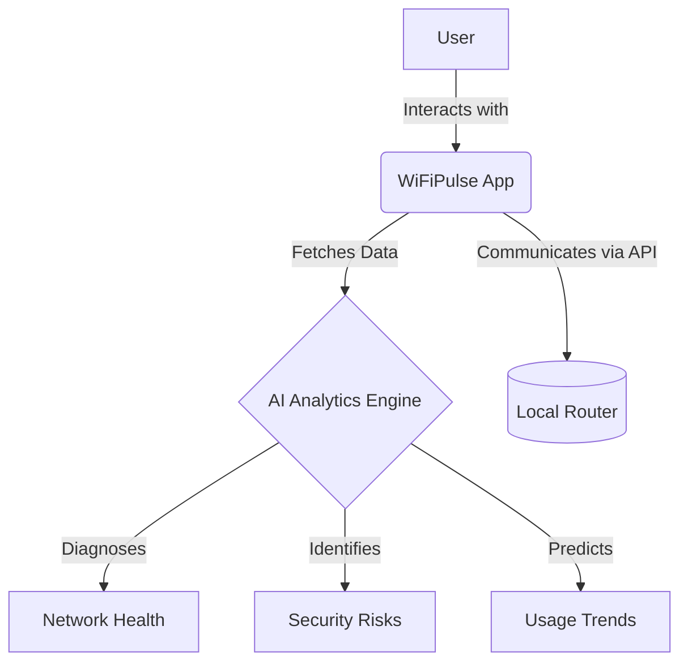

# WiFiPulse
## Master Product Requirements Document
### Version 1.0

 
 

**Prepared By:** `[Placeholder: Author Name/Team]` 
**Date:** `[Placeholder: YYYY-MM-DD]` 
**Status:** `[Placeholder: Draft / Under Review / Approved]` 

---

## Document Metadata

| Property | Details |
|----------|---------|
| **Document Owner** | `[Placeholder: Name/Role]` |
| **Product Manager** | `[Placeholder: Name]` |
| **Technical Lead** | `[Placeholder: Name]` |
| **Target Release** | `[Placeholder: Target Release Version]` |

## Revision History

| Version | Date | Author | Description of Changes |
|---------|------|--------|------------------------|
| 1.0 | 2026-06-30 | AI Assistant | Initial PRD Template Creation |
| 1.1 | 2026-06-30 | AI Assistant | Wrote PRD Chapter 1 (Sections 1-7) |
| 1.2 | 2026-06-30 | AI Assistant | Wrote PRD Chapter 2 (Product Strategy) |
## Approvals

| Name | Role | Date | Signature |
|------|------|------|-----------|
| `[Name]` | Product Manager | `[YYYY-MM-DD]` | `[Signature/Approved]` |
| `[Name]` | Engineering Lead | `[YYYY-MM-DD]` | `[Signature/Approved]` |

---

## Conventions & Guidelines

### Requirement ID Conventions
All requirements must be tracked using a unique identifier following this format: `[CATEGORY]-[NUMBER]`.
- **REQ-F-###**: Functional Requirements
- **REQ-NF-###**: Non-Functional Requirements
- **REQ-S-###**: Security Requirements
- **REQ-UI-###**: UI/UX Requirements

### Feature Numbering
Features are numbered hierarchically corresponding to their module (e.g., `Module 1.0`, `Feature 1.1`, `Sub-feature 1.1.1`).

### Priority Definitions
| Priority | Definition |
|----------|------------|
| **Critical** | Essential for product launch (P0). Product cannot ship without it. |
| **High** | Important feature (P1). Adds significant value but has workarounds. |
| **Medium** | Nice to have (P2). Improves UX but not strictly necessary for core function. |
| **Low** | Minimal impact (P3). Candidate for future releases. |

### Requirement Status Definitions
- **Proposed:** Initially drafted, pending review.
- **Approved:** Approved by stakeholders for implementation.
- **In Progress:** Currently under development.
- **Completed:** Developed, tested, and integrated.
- **Deferred:** Pushed to a future release phase.

---

## Table of Contents
1. [Executive Summary](#1-executive-summary)
2. [Product Vision](#2-product-vision)
3. [Mission Statement](#3-mission-statement)
4. [Problem Statement](#4-problem-statement)
5. [Solution Overview](#5-solution-overview)
6. [Product Goals](#6-product-goals)
7. [Non Goals](#7-non-goals)
8. [Target Audience](#8-target-audience)
9. [User Personas](#9-user-personas)
10. [Market Research](#10-market-research)
11. [Competitive Analysis](#11-competitive-analysis)
12. [Product Positioning](#12-product-positioning)
13. [SWOT Analysis](#13-swot-analysis)
14. [Feature Roadmap](#14-feature-roadmap)
15. [Functional Requirements](#15-functional-requirements)
16. [Non Functional Requirements](#16-non-functional-requirements)
17. [Information Architecture](#17-information-architecture)
18. [Feature Modules](#18-feature-modules)
19. [Technical Architecture](#19-technical-architecture)
20. [UI Design Principles](#20-ui-design-principles)
21. [Security Requirements](#21-security-requirements)
22. [AI Features](#22-ai-features)
23. [Router Integration Strategy](#23-router-integration-strategy)
24. [Database Design](#24-database-design)
25. [API Design](#25-api-design)
26. [Performance Requirements](#26-performance-requirements)
27. [Testing Strategy](#27-testing-strategy)
28. [Analytics](#28-analytics)
29. [Accessibility](#29-accessibility)
30. [Monetization Strategy](#30-monetization-strategy)
31. [Release Plan](#31-release-plan)
32. [Future Roadmap](#32-future-roadmap)
33. [Risks](#33-risks)
34. [Assumptions](#34-assumptions)
35. [Open Questions](#35-open-questions)
36. [Glossary](#36-glossary)

---

## 1. Executive Summary
WiFiPulse is a premium, AI-powered Wi-Fi intelligence platform designed exclusively for Android. It bridges the gap between complex network administration and everyday user experience by offering an intuitive, aesthetically stunning application for managing, analyzing, and securing home networks. By leveraging on-device analytics and AI-driven insights, WiFiPulse empowers users to optimize their connectivity, detect security vulnerabilities, and control connected devices without requiring advanced technical knowledge.

## 2. Product Vision
To be the definitive command center for the modern connected home, transforming invisible network data into actionable, easy-to-understand intelligence that guarantees secure and seamless digital experiences for every user.

## 3. Mission Statement
To deliver a flawless, high-performance Android application that abstracts the complexity of router management and network diagnostics into a beautiful, Material 3 interface, providing users with unprecedented visibility and control over their Wi-Fi environments.

## 4. Problem Statement
Home networks are becoming increasingly congested and vulnerable due to the proliferation of IoT devices. However, traditional network management tools and ISP-provided router applications are often fragmented, visually outdated, and overwhelmingly technical. Users struggle to identify why their internet is slow, who is connected to their network, or whether their network is secure, leading to frustration and unresolved connectivity issues.

## 5. Solution Overview
WiFiPulse provides a unified, mobile-first solution that automatically discovers and connects to the user's local router. 

The platform offers real-time dashboards for speed, usage, and device tracking, coupled with an AI analytics engine that proactively diagnoses network bottlenecks and security risks, presenting solutions in plain language.

## 6. Product Goals
- **G-1:** Achieve a cold startup time of under 2 seconds to ensure immediate access to network controls.
- **G-2:** Deliver a frictionless onboarding experience that successfully detects and connects to standard home routers with zero manual configuration.
- **G-3:** Provide proactive AI-driven alerts for unusual network activity or unauthorized device connections.
- **G-4:** Establish a premium visual identity that rivals top-tier consumer applications, measured by high user retention and aesthetic satisfaction scores.

## 7. Non Goals
- **NG-1:** We will not build custom router hardware; WiFiPulse is strictly a software platform interfacing with existing consumer routers.
- **NG-2:** We will not support iOS or Web platforms in the initial V1 release to maintain a laser focus on Android excellence.
- **NG-3:** We will not provide enterprise-grade B2B network management features (e.g., multi-site SDN management).

## 8. Target Audience
### Primary Users
Everyday smartphone users who experience home network issues (buffering, dead zones) but lack the technical expertise to diagnose them using traditional router interfaces.

### Secondary Users
Parents and household managers needing visibility into network usage, connected devices, and basic parental controls to manage screen time and ensure digital safety.

### Enterprise Users
Remote workers and small office administrators who require enterprise-grade reliability, security monitoring, and uptime guarantees for critical professional communications.

### Geographic Scope
Global release, with initial localization in English. The application is designed to be hardware-agnostic, supporting standard ISP-provided routers globally.

## 9. User Personas

### 1. The Student
- **Background:** College student sharing an apartment with multiple roommates.
- **Goals:** Ensure stable connection for online classes and streaming.
- **Pain Points:** Frequent bandwidth throttling when roommates download large files; unable to access router admin panels.
- **Technical Skill:** Moderate to High.
- **WiFi Usage Pattern:** High streaming, gaming, and video conferencing.
- **Key Features Needed:** Device discovery, bandwidth hogs identification, speed test.

### 2. The Family/Home User
- **Background:** Parent managing a household with 10+ smart devices (phones, TVs, tablets).
- **Goals:** Keep the family safe online and manage screen time.
- **Pain Points:** Overwhelmed by technical jargon; worried about strangers accessing the network.
- **Technical Skill:** Low.
- **WiFi Usage Pattern:** General browsing, streaming, smart home automation.
- **Key Features Needed:** One-tap security audit, unknown device alerts, intuitive usage dashboards.

### 3. The Gamer
- **Background:** Competitive online gamer heavily reliant on low latency.
- **Goals:** Absolute minimum ping and zero packet loss.
- **Pain Points:** Intermittent lag spikes ruining competitive matches; lack of QoS (Quality of Service) controls.
- **Technical Skill:** High.
- **WiFi Usage Pattern:** Continuous low-latency data streams.
- **Key Features Needed:** Real-time latency tracking, AI-driven bottleneck diagnosis, offline support.

### 4. The Remote Worker
- **Background:** Professional working from home full-time, relying on VPNs and Zoom.
- **Goals:** 99.9% uptime during business hours; secure connection to corporate networks.
- **Pain Points:** Unpredictable dropouts during critical meetings; security compliance requirements.
- **Technical Skill:** Moderate.
- **WiFi Usage Pattern:** Heavy upload/download, constant video conferencing.
- **Key Features Needed:** Security monitoring, usage analytics, network stability scoring.

### 5. The Small Office
- **Background:** Manager of a small business or co-working space.
- **Goals:** Provide reliable guest Wi-Fi while keeping internal assets secure.
- **Pain Points:** Managing multiple access points; identifying rogue devices.
- **Technical Skill:** Moderate.
- **WiFi Usage Pattern:** High concurrent connections.
- **Key Features Needed:** Multi-router management, detailed usage analytics, AI insights.

### 6. The Network Enthusiast
- **Background:** Tech hobbyist running custom router firmware and smart home labs.
- **Goals:** Maximum visibility into packet routing, signal strength, and channel interference.
- **Pain Points:** Consumer apps abstract too much data, offering no real diagnostic value.
- **Technical Skill:** Expert.
- **WiFi Usage Pattern:** Extreme (IoT networks, NAS servers, homelabs).
- **Key Features Needed:** Advanced router management, deep AI insights, raw diagnostic data export.

## 10. Market Research
The home WiFi landscape is undergoing a massive transformation driven by the exponential growth of connected devices.
- **Growth of Home WiFi:** The transition to remote work and 4K/8K streaming has made robust home WiFi a utility as essential as electricity.
- **Connected Device Trends:** The average household now manages upwards of 15-20 connected devices, creating complex, multi-layered network environments that are highly susceptible to interference and bandwidth starvation.
- **Smart Home Adoption:** As IoT adoption accelerates, the attack surface for home networks expands. Users are increasingly aware of vulnerabilities but lack the tools to audit their smart home ecosystem.
- **Need for Network Visibility:** Traditional ISP routers provide "black box" experiences. When internet fails, users instinctively blame the ISP, unaware that the issue is often local channel interference or a specific bandwidth-hogging device.
- **AI-Assisted Networking:** The market is shifting from reactive diagnostics (user runs a speed test after lag occurs) to proactive AI-assisted networking (the system predicts lag based on historical usage and suggests channel switching).

## 11. Competitive Analysis

| Feature | WiFiPulse | Fing | WiFiman | Google Home | TP-Link Tether | Net Analyzer | Aruba Utilities |
|---------|-----------|------|---------|-------------|----------------|--------------|-----------------|
| **Device Discovery** | High | High | High | Low | Medium | High | High |
| **Usage Analytics** | High | Low | Low | Medium | Low | Low | Low |
| **AI Insights** | High | None | None | None | None | None | None |
| **Router Management**| High | None | None | High (Google Only) | High (TP-Link Only) | None | None |
| **Speed Test** | High | High | High | High | Low | None | Low |
| **Security Monitoring**| High | Medium| Low | Low | Low | Low | Low |
| **Offline Support** | High | Low | Medium| Low | Low | Low | Medium|

## 12. Product Positioning
WiFiPulse is fundamentally different from existing network tools. It is not just a passive WiFi scanner or a walled-garden router companion app. WiFiPulse is an **AI-powered WiFi Intelligence Platform**. 

While competitors like Fing offer raw network mapping and Net Analyzer offers technical diagnostics, they require the user to interpret the data. Conversely, apps like Google Home or TP-Link Tether offer great UX but are strictly locked to proprietary hardware. WiFiPulse bridges this gap by remaining hardware-agnostic, providing deep technical diagnostics, and crucially, utilizing AI to interpret that data into actionable, plain-English advice for the everyday user.

## 13. SWOT Analysis

### Strengths
- **AI-Driven Insights:** Differentiates the product from passive scanners by providing proactive solutions.
- **Hardware Agnostic:** Works across various router brands, avoiding vendor lock-in.
- **Premium UX:** Material 3 design provides a modern, trustworthy interface lacking in technical competitor apps.
- **Offline Support:** Core diagnostic features function even when the external internet is down.

### Weaknesses
- **API Limitations:** Deep router management depends on the availability and openness of specific router APIs.
- **Resource Intensive:** On-device AI analytics and continuous background monitoring may impact battery life.

### Opportunities
- **ISP Partnerships:** Potential to white-label the software for smaller ISPs lacking a premium mobile app.
- **Smart Home Integration:** Future integrations with Matter and Thread protocols to manage local IoT ecosystems directly.
- **Freemium Upsell:** Strong potential for monetizing advanced AI security audits or historical data retention.

### Threats
- **ISP Walled Gardens:** Major ISPs increasingly locking down local router access to force users into their proprietary apps.
- **OS Restrictions:** Android networking API restrictions (e.g., MAC address randomization, strict location permissions) complicating device discovery.
- **Incumbent Dominance:** Well-established apps like Fing possess massive existing install bases.

## 14. Feature Roadmap
> `[Placeholder: Provide a high-level timeline or phased release schedule of major features.]`

## 15. Functional Requirements
> `[Placeholder: Detailed list of functional requirements using the defined REQ-F-### conventions.]`

## 16. Non Functional Requirements
> `[Placeholder: Detailed list of system performance, reliability, and usability requirements (REQ-NF-###).]`

## 17. Information Architecture
> `[Placeholder: Outline the application structure, navigation flow, and screen hierarchy.]`

## 18. Feature Modules
> `[Placeholder: Break down the application into discrete functional modules.]`

## 19. Technical Architecture
> `[Placeholder: Describe the system architecture, frameworks (Flutter, Riverpod), and infrastructure.]`

## 20. UI Design Principles
> `[Placeholder: Define the visual language, design system, and Material 3 adherence guidelines.]`

## 21. Security Requirements
> `[Placeholder: Detail encryption, authentication, authorization, and data protection rules (REQ-S-###).]`

## 22. AI Features
> `[Placeholder: Detail any AI/ML driven insights, automation, or analytics features.]`

## 23. Router Integration Strategy
> `[Placeholder: Explain how the application interfaces with and controls supported routers.]`

## 24. Database Design
> `[Placeholder: Outline the local (SQLite) and remote (Firebase) database schema structures.]`

## 25. API Design
> `[Placeholder: Describe external API endpoints, internal service contracts, and data structures.]`

## 26. Performance Requirements
> `[Placeholder: Define strict performance metrics, e.g., cold start < 2s, 60fps animations.]`

## 27. Testing Strategy
> `[Placeholder: Detail unit, integration, UI, and user acceptance testing methodologies.]`

## 28. Analytics
> `[Placeholder: Define what user behaviors, errors, and system metrics will be tracked.]`

## 29. Accessibility
> `[Placeholder: Outline ADA compliance goals, screen reader support, and contrast requirements.]`

## 30. Monetization Strategy
> `[Placeholder: Describe the revenue model, e.g., freemium, subscriptions, ads, or one-time purchase.]`

## 31. Release Plan
> `[Placeholder: Detail the alpha, beta, and public launch milestones.]`

## 32. Future Roadmap
> `[Placeholder: Outline visionary features and integrations planned beyond the initial release.]`

## 33. Risks
> `[Placeholder: Identify potential technical, market, or execution risks and mitigation strategies.]`

## 34. Assumptions
> `[Placeholder: List assumptions made during the PRD creation that require validation.]`

## 35. Open Questions
> `[Placeholder: List any unresolved product decisions that need stakeholder alignment.]`

## 36. Glossary
> `[Placeholder: Define project-specific terms, acronyms, and technical jargon.]`
